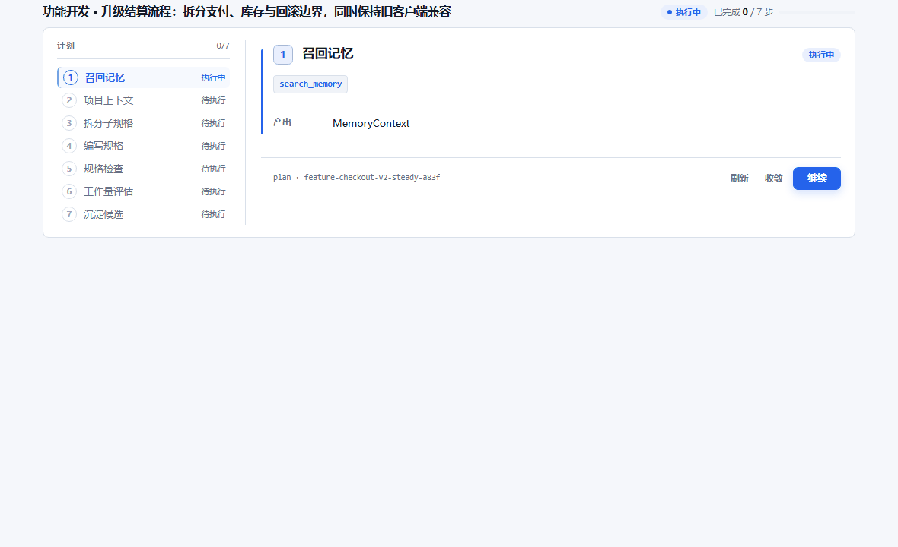
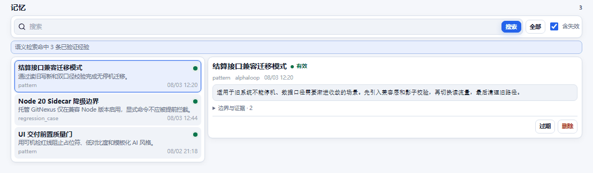
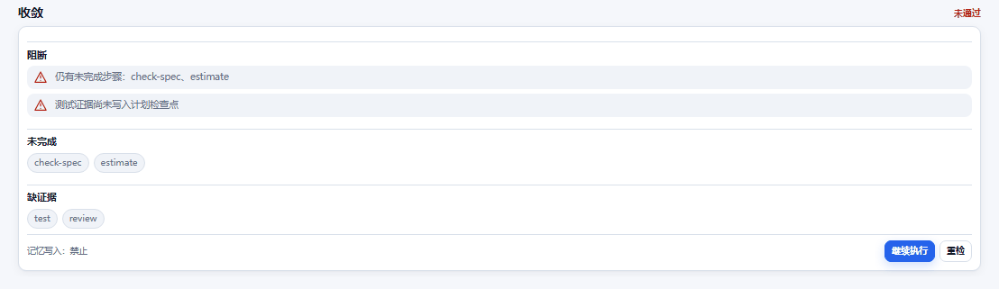

# mcp-probe-kit — Know the Context, Feed the Moment

<div align="center">
  
  <h1>知时MCP | mcp-probe-kit</h1>
  <p><strong>Know the Context, Feed the Moment.</strong></p>
  <p>
    <code>Introspection</code> · <code>Context Hydration</code> · <code>Delegated Orchestration</code>
  </p>
</div>

---

<!-- mcp-name: io.github.mybolide/mcp-probe-kit -->

> **Talk is cheap, show me the Context.**
> 
> mcp-probe-kit is a protocol-level toolkit designed for developers who want AI to understand project intent, choose a precise workflow, and retain validated experience without flooding the model with internal actions.

**Languages**: [English](README.md) | [简体中文](i18n/README.zh-CN.md) | [日本語](i18n/README.ja-JP.md) | [한국어](i18n/README.ko-KR.md) | [Español](i18n/README.es-ES.md) | [Français](i18n/README.fr-FR.md) | [Deutsch](i18n/README.de-DE.md) | [Português (BR)](i18n/README.pt-BR.md)

[](https://www.npmjs.com/package/mcp-probe-kit)
[](https://www.npmjs.com/package/mcp-probe-kit)
[](https://opensource.org/licenses/MIT)
[](https://github.com/mybolide/mcp-probe-kit/stargazers)
[](https://mseep.ai/app/ce79a9e5-7422-4862-b235-bc3d65710397)

> 🚀 AI-Powered Complete Development Toolkit - Covering the Entire Development Lifecycle

A powerful MCP (Model Context Protocol) server with **23 model-visible tools by default**, **29 when Memory is configured**, and a **33-tool compatibility surface** available through `MCP_TOOLSET=full`. It covers the complete workflow from product analysis to final release and supports structured output.

**🎉 v4 release candidate**: native MCP Apps, resumable plans, evidence convergence, managed GitNexus Sidecar, parent-child specs, and a version-locked CLI fallback.

**Supports All MCP Clients**: Cursor, Claude Desktop, Cline, Continue, and more

**Protocol Support**: Legacy MCP (2025-era) + Modern MCP 2026-07-28 · **SDK**: split TypeScript SDK v2 packages

**Runtime**: Node.js 20 or newer. `MCP_PROTOCOL_MODE=auto` is the default; use `legacy` or `modern` only for compatibility diagnosis.

---

<!-- v4-showcase:start -->
## 🎬 v4 in action

v4 turns delegated Agent work into an observable and verifiable delivery loop. The animations below are rendered from the same MCP App source shipped in the npm package—not separate marketing mockups.

<p align="center">
  <a href="https://mcp-probe-kit.bytezonex.com/pages/apps.html"></a>
</p>

**Feature Workbench** — parent-child specs, active step, outputs, evidence, and cross-session recovery.

<p align="center">
  <a href="https://mcp-probe-kit.bytezonex.com/pages/apps.html#memory"></a>
</p>

<strong>Memory Center</strong> — semantic search, full-content inspection, lifecycle state, evidence, stale marking, and confirmed deletion.

<p align="center">
  <a href="https://mcp-probe-kit.bytezonex.com/pages/apps.html#convergence"></a>
</p>

<strong>Convergence Gate</strong> — blocks closure when steps or requirements/spec/implementation/test/review evidence are incomplete.

- **Five native MCP Apps**: Memory Center, Feature Workbench, Bug Workbench, Product Workbench, and Convergence Gate.
- **Resumable delegated plans**: `plan_heartbeat` persists real progress; `resume_plan` restores the next executable step.
- **Evidence-based convergence**: `converge` gates delivery and long-term Memory writes.
- **Managed GitNexus Sidecar**: version/platform/architecture/Node isolation, integrity verification, real FTS probe, and safe degradation.
- **Version-locked CLI fallback**: project-local `probe` wrappers reach the same Tool Registry when a host drops the MCP tool lease.
- **Parent-child specifications**: complex releases are decomposed and recursively validated instead of being flattened into one oversized spec.

**[Open the five live, read-only MCP App demos](https://mcp-probe-kit.bytezonex.com/pages/apps.html)**

> **v4 preview channel:** use `mcp-probe-kit@next` (currently `4.0.0-rc.8`). npm `latest` remains the stable `3.7.0` channel. Pin an exact version for production evaluation.
<!-- v4-showcase:end -->

---

## 📚 Complete Documentation

**👉 [https://mcp-probe-kit.bytezonex.com](https://mcp-probe-kit.bytezonex.com/)**

- [Quick Start](https://mcp-probe-kit.bytezonex.com/pages/getting-started.html) - Setup in 5 minutes
- [Local Memory Stack (Qdrant + Nomic Embed)](docs/memory-local-setup.md) - Docker Compose, ports `50008` / `50012`, MCP env
- [All Tools](https://mcp-probe-kit.bytezonex.com/pages/all-tools.html) - Default, conditional Memory, App-only, and full compatibility surfaces
- [Best Practices](https://mcp-probe-kit.bytezonex.com/pages/examples.html) - Full development workflow guide
- [v3 → v4 Migration Guide](https://mcp-probe-kit.bytezonex.com/pages/migration-v4.html) - Tool surfaces, protocol, Apps, plan state, Memory, and compatibility
- [MCP Apps Live Demos](https://mcp-probe-kit.bytezonex.com/pages/apps.html) - Five real read-only workbenches generated from the shipped App source

---

## ✨ Core Features

### 📦 Tool Surfaces

The default `compact` surface keeps every independently useful workflow while removing competing internal and maintenance entries from the model context.

- **🧭 Routing** (1) — `workflow`
- **🔁 Plan State & Convergence** (3) — `plan_heartbeat`, `resume_plan`, `converge`
- **🔄 Workflow Orchestration** (6) — `start_feature`, `start_bugfix`, `start_onboard`, `start_ui`, `start_product`, `start_ralph`
- **📦 Project & Specification** (4) — `init_project`, `init_project_context`, `check_spec`, `estimate`
- **🔍 Code, Test & Git** (6) — `code_insight`, `gentest`, `code_review`, `refactor`, `gencommit`, `git_work_report`
- **🎨 UI/UX Utilities** (2) — `ui_design_system`, `ui_search`
- **🗣️ Structured Interview** (1) — `interview`

That is **23 model-visible tools by default**. When the full Memory stack is configured, six Memory tools are added dynamically, bringing the model-visible surface to **29**:

`search_memory`, `read_memory_asset`, `memorize_asset`, `update_memory_asset`, `delete_memory_asset`, `scan_and_extract_patterns`

For compatibility and diagnostics, `MCP_TOOLSET=full` restores all **33 legacy model tools**. The compact surface deliberately omits `add_feature`, `fix_bug`, `sync_ui_data`, and `ask_user`: their implementations remain available through orchestration, maintenance scripts, or full compatibility mode.

### 🔁 Delegated Plan State, Recovery, and Convergence

- Every v4 delegated plan declares `executionStatePolicy` and instructs the Agent to create a local checkpoint on the first step.
- `plan_heartbeat` persists completed/skipped steps, unresolved items, evidence, and the last verified revision under `.mcp-probe-kit/plans/`.
- `resume_plan` recalculates ready and blocked steps from stored dependencies after interruption, restart, or Agent handoff.
- `converge` refuses closure while steps, unresolved items, or requirements/spec/implementation/test/review evidence are incomplete. Formal long-term memory writes are allowed only after convergence passes.
- These tools track and validate Agent execution; they do not move file, shell, Git, or implementation work into the MCP server.

### 🛡️ Quality Constraints (single source of truth)

All hard quality rules live in one module (`src/lib/quality-constraints.ts`) and are injected into `code_review`, the `add_feature` task templates, and the UI tools. Change once, apply everywhere — inspired by [taste-skill](https://github.com/Leonxlnx/taste-skill) and [impeccable](https://github.com/pbakaus/impeccable).

- **Code limits**: single file ≤ 500 lines (split into modules/components when exceeded), function ≤ 50 lines, nesting ≤ 4, parameters ≤ 3.
- **Completeness blacklist**: `code_review` flags placeholder/elision patterns (`// ...`, `// TODO`, `// rest of code`, bare `...`) as CRITICAL — "a partial output is a broken output".
- **Anti-laziness task templates**: `add_feature` tasks now carry a Scope-lock deliverable count, a mandatory evidence block (read code before writing), a per-file line budget, and a binary zero-tolerance rule for placeholders. `check_spec` validates these (missing Scope-lock = error, thin task without evidence = warning).
- **UI hard red lines**: numeric, machine-checkable rules — 4pt spacing scale, WCAG contrast (4.5/3/3), type scale ≥ 1.25, hero font ≤ 6rem, OKLCH, eight interaction states, cognitive load ≤ 4, motion 150-300ms.
- **UI banned list + Pre-Flight checklist**: match-and-refuse blacklist for AI slop (default Inter/Roboto, AI purple-blue gradients, gradient text, cookie-cutter card grids, em-dash, cream/beige body backgrounds, nested cards) plus a delivery-gate self-check matrix.

### 🧠 Code Graph Bridge (GitNexus)

- `code_insight` bridges GitNexus by default for query/context/impact analysis
- The bridge prefers an explicitly configured or system GitNexus CLI, then a version-locked managed Sidecar; GitNexus is not bundled into the main package and is never globally installed
- `init_project_context` bootstraps baseline graph docs under `docs/graph-insights/`; if `docs/project-context.md` already exists, it preserves the old context docs and only backfills graph docs plus the index entry
- `start_feature` refreshes the GitNexus index and runs task-level `query/context/impact` narrowing before spec generation to reduce over-scoping
- `start_bugfix` refreshes the GitNexus index and runs task-level graph analysis before TBP RCA to constrain failure boundary and blast radius
- Older projects that already have `project-context.md` but no graph docs are bootstrapped automatically through the `init_project_context` step
- If GitNexus is unavailable, the server falls back automatically without breaking orchestration
- Real graph queries read the `.gitnexus` index; `docs/graph-insights/latest.md|json` are readable snapshots for humans and AI agents
- MCP resources in MCP client settings list **2 entries** (`probe://status`, `probe://project/bootstrap`). Graph runtime snapshots (`probe://graph/latest`, etc.) and `probe://project/skill|agents|context|graph` remain readable via `resources/read` when tools expose URIs
- Graph snapshots are persisted to `.mcp-probe-kit/graph-snapshots` (customizable via `MCP_GRAPH_SNAPSHOT_DIR`)
- Tool responses include `_meta.graph` with snapshot URI and local JSON/Markdown file paths

### 🐛 SRC-8 Bug Root-Cause Workflow (TBP-Inspired)

- **[SRC-8 Methodology](docs/src8-methodology.md)** (中文: [src8-methodology.zh-CN.md](docs/src8-methodology.zh-CN.md)) — Software Root-Cause 8-step protocol inspired by Toyota TBP / PDCA, adapted for code and AI agents
- `start_bugfix` runs graph narrowing, then **delegated SRC-8 plan** (`metadata.plan.steps` src8-1~8) before repair and tests
- `fix_bug` returns **delegated plan** (src8-1~8), `src8Checklist`, **`rootCauseWorksheet`** (Step 4 core), and hard gates (no code change until root-cause worksheet is closed)
- Highlights vs manufacturing TBP: **repro contract**, **attribution layers** (including `agent_behavior`), **contributing factors**, **memorize_asset** for cross-repo learning

**Inherited from Toyota TBP:** gap thinking, Plan-before-Do, no skipping to root-cause analysis, fact-based investigation, countermeasures over symptoms, evaluate then standardize.

**Our elevation:** genchi-genbutsu → read code/logs/repro; Step 4 worksheet; guidance-only MCP that forces discipline while the Agent executes.

### 🧠 Memory Retrieval

- Memory tools use **Qdrant** as the vector database backend
- Embedding service supports two modes:
  - `ollama`
  - `openai-compatible`

**Memory tools:**
- `search_memory` - Semantic search across the shared memory pool (optionally prefer `type` / `tags`); text output includes `id`, `score`, summary, description, and a `--- content ---` body (default up to 1500 chars via `MEMORY_SEARCH_CONTENT_MAX_CHARS`)
- `memorize_asset` - Persist an already validated `MemoryCandidate` into vector memory; for delegated workflows, call it only after `converge` passes
- `read_memory_asset` - Read full asset content by `asset_id` (text output includes the full `content` body)
- `update_memory_asset` - Update an existing asset by `asset_id` (preserves ID; `content` changes re-embed)
- `delete_memory_asset` - Delete an asset by `asset_id` from the shared pool
- `scan_and_extract_patterns` - Extract reusable patterns from code/file/directory before deciding whether to persist

**Cross-repo memory pools:** do not rely on `source_project` / `source_path` for shared retrieval; put file paths in `content` instead. Search injection hides foreign `sourcePath` unless `MEMORY_REPO_ID` matches or `MEMORY_SEARCH_SHOW_SOURCE=true`.

**Memory backend and embedding configuration:**
- Vector database: **Qdrant**
- **Recommended local setup:** `Qdrant (port 50008) + Infinity / nomic-embed (port 50012)` — lighter than Ollama; see **[Local Memory Stack guide](docs/memory-local-setup.md)** (中文: [memory-local-setup.zh-CN.md](docs/memory-local-setup.zh-CN.md))
- Supported embedding providers:
  - `ollama`
  - `openai-compatible` (Infinity, OpenAI, etc.)
- Required environment variables for memory write/search:
  - `MEMORY_QDRANT_URL`
  - `MEMORY_EMBEDDING_URL`
  - `MEMORY_EMBEDDING_MODEL`
- Optional environment variables:
  - `MEMORY_QDRANT_API_KEY`
  - `MEMORY_QDRANT_COLLECTION` (default: `mcp_probe_memory`)
  - `MEMORY_EMBEDDING_API_KEY`
  - `MEMORY_EMBEDDING_PROVIDER` (`ollama` by default)
  - `MEMORY_SEARCH_LIMIT` (default: `3`)
  - `MEMORY_SUMMARY_MAX_CHARS` (default: `280`)
  - `MEMORY_SEARCH_MIN_SCORE` (default: `0` = disabled; try `0.72` for noisy pools)
  - `MEMORY_SEARCH_SHOW_SOURCE` (default: `false`)
  - `MEMORY_REPO_ID` (optional; show `sourcePath` only when `sourceProject` matches)
  - `MEMORY_INJECTION_CONTENT_MAX_CHARS` (default: `1500`; max content per hit injected into `start_*` guides)
- Behavior notes:
  - Read-only memory access only requires `MEMORY_QDRANT_URL`
  - Memory write is enabled only when `MEMORY_QDRANT_URL`, `MEMORY_EMBEDDING_URL`, and `MEMORY_EMBEDDING_MODEL` are all configured
  - The Qdrant collection is auto-created on first write, and vector dimension is inferred from the first embedding response

**Recommended local memory setup (Qdrant + Nomic Embed / Infinity):**

Full Docker Compose, ports, and troubleshooting: **[docs/memory-local-setup.md](docs/memory-local-setup.md)**

```json
{
  "mcpServers": {
    "mcp-probe-kit": {
      "command": "npx",
      "args": ["-y", "mcp-probe-kit@next"],
      "env": {
        "MEMORY_QDRANT_URL": "http://127.0.0.1:50008",
        "MEMORY_QDRANT_API_KEY": "your-qdrant-api-key",
        "MEMORY_QDRANT_COLLECTION": "mcp_probe_memory",
        "MEMORY_EMBEDDING_PROVIDER": "openai-compatible",
        "MEMORY_EMBEDDING_URL": "http://127.0.0.1:50012/embeddings",
        "MEMORY_EMBEDDING_MODEL": "nomic-ai/nomic-embed-text-v1.5",
        "MEMORY_EMBEDDING_API_KEY": "your-infinity-api-key",
        "MEMORY_SEARCH_LIMIT": "3",
        "MEMORY_SUMMARY_MAX_CHARS": "280"
      }
    }
  }
}
```

**Alternative: Qdrant + Ollama** (if you already run Ollama):

```bash
docker run -d --name mcp-qdrant -p 6333:6333 qdrant/qdrant
ollama pull nomic-embed-text
```

```json
"MEMORY_QDRANT_URL": "http://127.0.0.1:6333",
"MEMORY_EMBEDDING_PROVIDER": "ollama",
"MEMORY_EMBEDDING_URL": "http://127.0.0.1:11434/api/embeddings",
"MEMORY_EMBEDDING_MODEL": "nomic-embed-text"
```

**OpenAI-compatible embedding (hosted API):**
```json
{
  "mcpServers": {
    "mcp-probe-kit": {
      "command": "npx",
      "args": ["-y", "mcp-probe-kit@next"],
      "env": {
        "MEMORY_QDRANT_URL": "http://127.0.0.1:6333",
        "MEMORY_QDRANT_COLLECTION": "mcp_probe_memory",
        "MEMORY_EMBEDDING_PROVIDER": "openai-compatible",
        "MEMORY_EMBEDDING_URL": "https://your-embedding-endpoint/v1/embeddings",
        "MEMORY_EMBEDDING_API_KEY": "your-api-key",
        "MEMORY_EMBEDDING_MODEL": "text-embedding-3-small"
      }
    }
  }
}
```

### 🎯 Structured Output

Core and orchestration tools support **structured output**, returning machine-readable JSON data, improving AI parsing accuracy, supporting tool chaining and state tracking.

### ⏱️ Native Tasks, Progress, and Cancellation

- Uses an SDK-independent Internal Task Runtime, with the current SDK task protocol exposed through a Legacy Adapter
- Supports task lifecycle endpoints: `tasks/get`, `tasks/result`, `tasks/list`, `tasks/cancel`
- Advertises `capabilities.tasks.requests.tools.call` so clients can create tasks for `tools/call`
- Falls back to synchronous execution when protocol task storage is unavailable
- Emits `notifications/progress` when client provides `_meta.progressToken`
- Ignores late progress after terminal completion; tool/task result is the final completion signal
- Handles request cancellation via `AbortSignal` and preserves a clear `cancelled` state
- Long-running orchestration tools (`start_*`) and `sync_ui_data` support cooperative cancellation/progress callbacks
- Internal task persistence defaults to memory. Set `MCP_TASK_STORE=json` to use `.mcp-probe-kit/tasks.json`, or set `MCP_TASK_STORE_PATH` to choose another JSON path. Interrupted tasks that cannot reconstruct their executor are explicitly marked failed on restart instead of being reported as still running.

### 🔌 Official MCP Apps and Memory Center

v4.0.0-rc.8 uses the official `@modelcontextprotocol/ext-apps` SDK and the stable `io.modelcontextprotocol/ui` extension.

- MCP Apps are enabled by default and can be disabled with `MCP_ENABLE_UI_APPS=0`.
- UI metadata and `ui://` resources are exposed only after the client advertises support for `text/html;profile=mcp-app`.
- Five stable Apps are included: **Memory Center**, **Feature Workbench**, **Bug Workbench**, **Product Workbench**, and **Convergence Gate**.
- Memory Center uses a responsive master-detail layout for historical browsing, semantic search, full-content inspection, lifecycle state, evidence, stale marking, and confirmed deletion.
- Feature and Bug Workbenches render a live plan stepper. The App polls `resume_plan` while visible, and progress advances only after the Agent records real step state through `plan_heartbeat`.
- Product Workbench and Convergence Gate use the same developer-console design system for delivery paths, blockers, and evidence gaps.
- `list_memory_assets` is an App-only action with `_meta.ui.visibility=["app"]`. It may appear in the raw `tools/list` response of an Apps-capable host, but compliant hosts must not offer it to the model. The model-visible count remains 23 or 29.
- Clients without MCP Apps support continue to receive the normal text and `structuredContent` responses; no GUI capability is required for existing workflows.
- Trace metadata passthrough remains available through `MCP_ENABLE_EXTENSIONS_CAPABILITY=1`.

### 🧪 Tool and Real-Agent Contract Verification

```bash
# Deterministic server-side audit across compact, Memory, full, App-only, and Legacy surfaces
npm run audit:tools

# Optional real-host audit: Claude Code calls and evaluates all 33 model tools
npm run audit:tools:agent
```

The direct audit verifies non-empty readable text, `structuredContent`, and that every referenced MCP tool exists on the active surface. The real-Agent audit additionally checks whether an Agent understands each tool, can follow the returned guidance, sees no text/structured contradiction, and can execute the stated next step. It is intentionally separate from `release:verify` because it requires a configured Claude Code account and incurs model usage.

### 🧭 Delegated Orchestration Protocol

All `start_*` orchestration tools return an **execution plan** in `structuredContent.metadata.plan`.  
AI needs to **call tools step by step and persist files**, rather than the tool executing internally.

**Plan Schema (Core Fields)**:
```json
{
  "mode": "delegated",
  "steps": [
    {
      "id": "spec",
      "tool": "add_feature",
      "args": { "feature_name": "user-auth", "description": "User authentication feature" },
      "outputs": ["docs/specs/user-auth/requirements.md"]
    }
  ]
}
```

**Field Description**:
- `mode`: Fixed as `delegated`
- `steps`: Array of execution steps
- `tool`: Tool name (e.g. `add_feature`)
- `action`: Manual action description when no tool (e.g. `update_project_context`)
- `args`: Tool parameters
- `outputs`: Expected artifacts
- `when/dependsOn/note`: Optional conditions and notes

### 🧩 Structured Output Field Specification (Key Fields)

Both orchestration and atomic tools return `structuredContent`, common fields:
- `summary`: One-line summary
- `status`: Status (pending/success/failed/partial)
- `steps`: Execution steps (orchestration tools)
- `artifacts`: Artifact list (path + purpose)
- `metadata.plan`: Delegated execution plan (only start_*)
- `specArtifacts`: Specification artifacts (start_feature)
- `estimate`: Estimation results (start_feature / estimate)

### 🧠 Requirements Clarification Mode (Requirements Loop)

When requirements are unclear, use `requirements_mode=loop` in `start_feature / start_bugfix / start_ui`.  
This mode performs 1-2 rounds of structured clarification before entering spec/fix/UI execution.

**Example:**
```json
{
  "feature_name": "user-auth",
  "description": "User authentication feature",
  "requirements_mode": "loop",
  "loop_max_rounds": 2,
  "loop_question_budget": 5
}
```

### 🧩 Template System (Regular Model Friendly)

`add_feature` supports template profiles, default `auto` auto-selects: prefers `guided` when requirements are incomplete (includes detailed filling rules and checklists), selects `strict` when requirements are complete (more compact structure, suitable for high-capability models or archival scenarios).

**Example:**
```json
{
  "description": "Add user authentication feature",
  "template_profile": "auto"
}
```

**Applicable Tools**:
- `start_feature` passes `template_profile` to `add_feature`
- `start_bugfix` / `start_ui` also support `template_profile` for controlling guidance strength (auto/guided/strict)

**Template Profile Strategy**:
- `guided`: Less/incomplete requirements info, regular model priority
- `strict`: Requirements structured, prefer more compact guidance
- `auto`: Default recommendation, auto-selects guided/strict

### Parent-Child Specifications

For version-level or epic work, `start_feature` defaults to `spec_layout: "auto"` and selects `parent-child` when the requirement spans multiple modules, stages, or capability domains. If child boundaries are not known yet, the delegated plan first returns a `decompose-spec` step. You can still explicitly pass `flat` or `parent-child`; `add_feature` remains an atomic tool and defaults to `flat` unless the layout and `subspecs` are already defined. The MCP server returns templates and `pendingFiles`; the calling Agent creates the parent spec, `spec-manifest.json`, and child specs after review. `check_spec` then validates the complete hierarchy recursively.

`start_feature` uses query-only GitNexus narrowing with an 8-second degradation budget, so graph cold starts do not block specification planning. Automatic index refresh is disabled by default; set `MCP_GITNEXUS_AUTO_REFRESH=1` when the MCP process should refresh the index before graph queries.

```json
{
  "feature_name": "commerce-v2",
  "description": "Upgrade the commerce domain while preserving v1 compatibility",
  "spec_layout": "parent-child",
  "subspecs": [
    { "id": "01-foundation", "title": "Data foundation", "fr": ["FR-1"] },
    { "id": "06-inventory-ledger", "title": "Inventory ledger", "fr": ["FR-2"], "dependsOn": ["01-foundation"] }
  ]
}
```

### 🔄 Workflow Orchestration

6 intelligent orchestration tools that automatically combine multiple basic tools for one-click complex development workflows:
- `start_feature` - New feature development (Requirements → Design → Estimation)
- `start_bugfix` - Bug fixing (SRC-8 RCA → Fix → Testing)
- `start_onboard` - Project onboarding (Generate project context docs)
- `start_ui` - UI development (Design system → Components → Code)
- `start_product` - Product design (PRD → Prototype → Design system → HTML)
- `start_ralph` - Ralph Loop (Iterative development until goal completion)

### 🚀 Product Design Workflow

`start_product` is a complete product design orchestration tool, from requirements to interactive prototype:

**Workflow:**
1. **Requirements Analysis** - Generate standard PRD (product overview, feature requirements, page list)
2. **Prototype Design** - Generate detailed prototype docs for each page
3. **Design System** - Generate design specifications based on product type
4. **HTML Prototype** - Generate interactive prototype viewable in browser
5. **Project Context** - Auto-update project documentation

**Structured Output Additions**:
- `start_product.structuredContent.artifacts`: Artifact list (PRD, prototypes, design system, etc.)
- `interview.structuredContent.mode`: `usage` / `questions` / `record`

### 🎨 UI/UX Pro Max

4 UI/UX tools with `start_ui` as the unified entry point:
- `start_ui` - One-click UI development (supports intelligent mode) (orchestration tool)
- `ui_design_system` - Intelligent design system generation
- `ui_search` - UI/UX data search (BM25 algorithm)
- `sync_ui_data` - Sync latest UI/UX data locally

**Note**: `start_ui` automatically calls `ui_design_system` and `ui_search`, you don't need to call them separately.

**Inspiration:**
- [ui-ux-pro-max-skill](https://github.com/nextlevelbuilder/ui-ux-pro-max-skill) - UI/UX design system philosophy
- [json-render](https://github.com/vercel-labs/json-render) - JSON template rendering engine

**Skill Bridge for UI/PRD workflows:**
- `start_ui` and `start_product` now include a Skill Bridge section in guidance and `structuredContent.metadata.skills`.
- Recommended skill call order: `ui-ux-pro-max` → `interaction-design` → `frontend-design`.
- If some skills are missing, workflow continues with MCP main plan and marks unavailable skills in metadata.

**Why use `sync_ui_data`?**

Our `start_ui` tool relies on a rich UI/UX database (colors, icons, charts, components, design patterns, etc.) to generate high-quality design systems and code. This data comes from npm package [uipro-cli](https://www.npmjs.com/package/uipro-cli), including:
- 🎨 Color schemes (mainstream brand colors, color palettes)
- 🔣 Icon libraries (React Icons, Heroicons, etc.)
- 📊 Chart components (Recharts, Chart.js, etc.)
- 🎯 Landing page templates (SaaS, e-commerce, government, etc.)
- 📐 Design specifications (spacing, fonts, shadows, etc.)

**Data Sync Strategy:**
1. **Embedded Data**: Synced at build time, works offline
2. **Background Auto Sync**: Downloads latest data to `~/.mcp-probe-kit/ui-ux-data/` without changing current session output
3. **Next-Start Activation**: Newly downloaded data is applied on next process start (keeps current session deterministic)
4. **Manual Sync**: Use `sync_ui_data` to force refresh cache immediately (still applies next start by default)

This ensures `start_ui` can generate professional-grade UI code even offline.

### 🎤 Requirements Interview

2 interview tools to clarify requirements before development:
- `interview` - Structured requirements interview
- `ask_user` - AI proactive questioning

---

## 🧭 Tool Selection Guide

### When to use orchestration tools vs individual tools?

**Use orchestration tools (start_*) when:**
- ✅ Need complete workflow (multiple steps)
- ✅ Want to automate multiple tasks
- ✅ Need to generate multiple artifacts (docs, code, tests, etc.)

**Use individual tools when:**
- ✅ Only need specific functionality
- ✅ Already have project context docs
- ✅ Need more fine-grained control

### Common Scenario Selection

| Scenario | Recommended Tool | Reason |
|---------|-----------------|--------|
| Develop new feature (complete flow) | `start_feature` | Auto-complete: spec→estimation |
| Only need feature spec docs | `add_feature` | More lightweight, only generates docs |
| Fix bug (complete flow) | `start_bugfix` | Delegated SRC-8 plan (src8-1~8) → fix → test → memorize |
| Only need bug analysis | `fix_bug` | Delegated SRC-8 plan + root-cause worksheet (methodology: [docs](docs/src8-methodology.md)) |
| Generate design system | `ui_design_system` | Directly generate design specs |
| Develop UI components | `start_ui` | Complete flow: design→components→code |
| Product design (requirements to prototype) | `start_product` | One-click: PRD→prototype→HTML |
| One-sentence requirement analysis | `init_project` | Generate complete project spec docs |
| Project onboarding docs | `init_project_context` | Generate tech stack/architecture/conventions |

---

## 🚀 Quick Start

### Method 1: Use directly with npx (Recommended)

No installation needed, use the latest version directly.

#### Cursor / Cline Configuration

**Config file location:**
- Windows: `%APPDATA%\Cursor\User\globalStorage\saoudrizwan.claude-dev\settings\cline_mcp_settings.json`
- macOS: `~/Library/Application Support/Cursor/User/globalStorage/saoudrizwan.claude-dev/settings/cline_mcp_settings.json`
- Linux: `~/.config/Cursor/User/globalStorage/saoudrizwan.claude-dev/settings/cline_mcp_settings.json`

**Config content:**
```json
{
  "mcpServers": {
    "mcp-probe-kit": {
      "command": "npx",
      "args": ["-y", "mcp-probe-kit@next"]
    }
  }
}
```

> **Skill & AGENTS auto-bootstrap (v3.6.3+)**: Every MCP tool call writes `.agents/skills/mcp-probe-kit/SKILL.md` and merges the `mcp-probe:context` block into `AGENTS.md`. Workspace root is **auto-detected** (Cursor injects `WORKSPACE_FOLDER_PATHS`; OpenCode project `opencode.json` sets cwd). No per-client `MCP_PROJECT_ROOT` unless global MCP cannot resolve the workspace — then set `MCP_PROJECT_ROOT` or pass `project_root` in tool args.

> **Multi-harness adapters (v3.6.8+)**: `AGENTS.md` and the canonical Skill stay the **single rule source**. If the project already has `.trae/`, `.lingma/`, `.comate/`, `.codebuddy/`, or `.claude/`, matching thin adapters (skill mirror or rules pointer) are written automatically — **no env vars**.

> **Version-locked CLI fallback (v4.0.0-rc.6+)**: Bootstrap also writes `.mcp-probe-kit/bin/probe.cmd|probe.ps1|probe` and `.mcp-probe-kit/runtime.json`. If a modified host or third-party Agent provider connects the MCP server but omits its tools from the Agent session, the generated Skill and Cursor rule instruct the Agent to invoke the same Tool Registry through the project wrapper. The wrapper pins the exact MCP package version, does not install globally, and does not modify the project's `package.json`.

Direct CLI examples:

```bash
# JSON from stdin is the most portable option
printf '%s' '{"intent":"build a task board","scenario":"feature","project_root":"."}' \
  | ./.mcp-probe-kit/bin/probe exec workflow --stdin

# Repair or install the project wrappers without a working MCP tool lease
npx --yes mcp-probe-kit@<exact-version> install-agent --project-root .
```


#### Claude Desktop Configuration

**Config file location:**
- Windows: `%APPDATA%\Claude\claude_desktop_config.json`
- macOS: `~/Library/Application Support/Claude/claude_desktop_config.json`
- Linux: `~/.config/Claude/claude_desktop_config.json`

**Config content:**
```json
{
  "mcpServers": {
    "mcp-probe-kit": {
      "command": "npx",
      "args": ["-y", "mcp-probe-kit@next"]
    }
  }
}
```

#### OpenCode Configuration

**Config file location:**
- Project-level: `opencode.json` (in project root)
- Global: `~/.config/opencode/opencode.json`

**Config content:**
```json
{
  "mcp": {
    "mcp-probe-kit": {
      "type": "local",
      "command": ["npx", "-y", "mcp-probe-kit@next"],
      "enabled": true
    }
  }
}
```

> **Note:** OpenCode uses `opencode.json` with a different schema from Cursor/Claude Desktop. The key `mcp` replaces `mcpServers`, `command` is an array, `type: "local"` is required, and environment variables use `environment` instead of `env`. See [OpenCode MCP docs](https://opencode.ai/docs/mcp) for details.

### Method 2: Global Installation

```bash
npm install -g mcp-probe-kit
```

Use in config file:
```json
{
  "mcpServers": {
    "mcp-probe-kit": {
      "command": "mcp-probe-kit"
    }
  }
}
```

### Optional Memory System Setup

If you want to use `memorize_asset`, `update_memory_asset`, `read_memory_asset`, `delete_memory_asset`, and `scan_and_extract_patterns`, configure as follows:

- **Qdrant only** (`MEMORY_QDRANT_URL`): `read_memory_asset`, `delete_memory_asset`
- **Qdrant + embedding** (all three `MEMORY_*` write/search vars): `search_memory`, `memorize_asset`, `update_memory_asset`
- **No memory backend**: `scan_and_extract_patterns` (local scan only; persist via `memorize_asset` when ready)

For full write/search you need both:

1. A **Qdrant** vector database
2. An **embedding service** in either `ollama` or `openai-compatible` mode

**Full guide (Docker Compose for Qdrant + Infinity, ports `50008` / `50012`, MCP env, smoke tests):**

- English: [docs/memory-local-setup.md](docs/memory-local-setup.md)
- 中文: [docs/memory-local-setup.zh-CN.md](docs/memory-local-setup.zh-CN.md)

#### Option A: Qdrant + Nomic Embed / Infinity (recommended)

Lightweight local stack; no Ollama. Deploy Qdrant and `nomic-embed` via Docker Compose (see guide), then:

```json
{
  "mcpServers": {
    "mcp-probe-kit": {
      "command": "npx",
      "args": ["-y", "mcp-probe-kit@next"],
      "env": {
        "MEMORY_QDRANT_URL": "http://127.0.0.1:50008",
        "MEMORY_QDRANT_API_KEY": "your-qdrant-api-key",
        "MEMORY_QDRANT_COLLECTION": "mcp_probe_memory",
        "MEMORY_EMBEDDING_PROVIDER": "openai-compatible",
        "MEMORY_EMBEDDING_URL": "http://127.0.0.1:50012/embeddings",
        "MEMORY_EMBEDDING_MODEL": "nomic-ai/nomic-embed-text-v1.5",
        "MEMORY_EMBEDDING_API_KEY": "your-infinity-api-key",
        "MEMORY_SEARCH_LIMIT": "3",
        "MEMORY_SUMMARY_MAX_CHARS": "280"
      }
    }
  }
}
```

> Embedding URL must be `/embeddings` (not `/v1/embeddings`). Qdrant requires `api-key` when `QDRANT__SERVICE__API_KEY` is set.

#### Option B: Qdrant + Ollama

```bash
docker run -d --name mcp-qdrant -p 6333:6333 qdrant/qdrant
ollama pull nomic-embed-text
```

```json
"MEMORY_QDRANT_URL": "http://127.0.0.1:6333",
"MEMORY_EMBEDDING_PROVIDER": "ollama",
"MEMORY_EMBEDDING_URL": "http://127.0.0.1:11434/api/embeddings",
"MEMORY_EMBEDDING_MODEL": "nomic-embed-text"
```

#### Option C: Qdrant + hosted OpenAI-compatible API

```json
"MEMORY_QDRANT_URL": "http://127.0.0.1:50008",
"MEMORY_EMBEDDING_PROVIDER": "openai-compatible",
"MEMORY_EMBEDDING_URL": "https://your-embedding-endpoint/v1/embeddings",
"MEMORY_EMBEDDING_API_KEY": "your-api-key",
"MEMORY_EMBEDDING_MODEL": "text-embedding-3-small"
```

#### Memory Environment Variables

- `MEMORY_QDRANT_URL`: Qdrant base URL, required for all memory features
- `MEMORY_QDRANT_API_KEY`: Optional Qdrant API key
- `MEMORY_QDRANT_COLLECTION`: Collection name, default `mcp_probe_memory`
- `MEMORY_EMBEDDING_PROVIDER`: `ollama` or `openai-compatible`
- `MEMORY_EMBEDDING_URL`: Embedding endpoint URL
- `MEMORY_EMBEDDING_API_KEY`: Optional for Ollama, usually required for hosted OpenAI-compatible providers
- `MEMORY_EMBEDDING_MODEL`: Default is `nomic-embed-text`
- `MEMORY_SEARCH_LIMIT`: Default search result count is `3`
- `MEMORY_SUMMARY_MAX_CHARS`: Default summary truncation length is `280`

#### Notes

- Memory write capability is enabled only when `MEMORY_QDRANT_URL`, `MEMORY_EMBEDDING_URL`, and `MEMORY_EMBEDDING_MODEL` are configured
- Memory read capability only requires `MEMORY_QDRANT_URL`
- Qdrant collections are auto-created on first write with `Cosine` distance
- Vector size is inferred from the first embedding response

### GitNexus Managed Runtime

Applies to `code_insight`, `start_feature`, `start_bugfix`, and `init_project_context`.

GitNexus is **not bundled** into the `mcp-probe-kit` npm tarball because it includes native, platform-specific dependencies and uses the PolyForm Noncommercial license. The runtime policy is:

1. Use `MCP_GITNEXUS_COMMAND` when explicitly configured.
2. Otherwise reuse an already validated managed Sidecar from the mcp-probe-kit user cache.
3. Otherwise use a compatible `gitnexus` CLI already available on `PATH`.
4. If no runtime is installed, graph analysis degrades immediately instead of blocking the main workflow. The Agent can run `doctor gitnexus --install` and retry automatically.

Validated compatibility:

| Node.js | Managed GitNexus |
|---------|------------------|
| 20-21 | Managed Sidecar disabled; use a system GitNexus CLI or degraded mode |
| 22+ / Windows、macOS、Linux | `1.6.9` |

Each managed installation is isolated by GitNexus version, operating system, CPU architecture, and Node.js major version. npm integrity is checked against the pinned release metadata before the runtime is accepted. The installer then runs `gitnexus doctor` plus a real TypeScript indexing probe and rejects any runtime that silently disables FTS/BM25 search.

Install or repair the managed Sidecar through the project launcher:

```powershell
# Windows
& ./.mcp-probe-kit/bin/probe.cmd doctor gitnexus --install
```

```bash
# macOS / Linux
./.mcp-probe-kit/bin/probe doctor gitnexus --install
```

The first installation can take several minutes because GitNexus includes native parsers, LadybugDB, ONNX Runtime, and post-install grammar builds. It runs outside the project and does not modify the project `package.json` or `node_modules`.

Available modes:

- `MCP_GITNEXUS_MODE=auto` — default; explicit/system/existing managed runtime, otherwise fast degradation.
- `MCP_GITNEXUS_MODE=managed` — require the managed Sidecar and allow installation during the graph request.
- `MCP_GITNEXUS_MODE=system` — use only explicit/system GitNexus; never install.
- `MCP_GITNEXUS_MODE=off` — disable GitNexus.
- `MCP_GITNEXUS_AUTO_INSTALL=1` — allow `auto` mode to install synchronously; not recommended for latency-sensitive clients.

Some GitNexus dependencies use native modules. On Windows, LadybugDB FTS also requires the OpenSSL runtime shipped with Git for Windows; mcp-probe-kit discovers its `mingw64/bin` directory and exposes it only to the managed child process. Set `MCP_GITNEXUS_WINDOWS_RUNTIME_BIN` to an equivalent directory when Git is installed in a nonstandard location. A failed prebuilt-binary download may still require Visual Studio Build Tools with the C++ workload. Installation failure never prevents the mcp-probe-kit workflow from continuing in degraded mode.

Example config using a preinstalled `gitnexus` CLI:

```json
{
  "mcpServers": {
    "mcp-probe-kit": {
      "command": "mcp-probe-kit",
      "env": {
        "MCP_GITNEXUS_MODE": "system",
        "MCP_GITNEXUS_COMMAND": "gitnexus",
        "MCP_GITNEXUS_ARGS": "mcp",
        "MCP_GITNEXUS_CONNECT_TIMEOUT_MS": "30000",
        "MCP_GITNEXUS_TIMEOUT_MS": "45000"
      }
    }
  }
}
```

### Restart Client

After configuration, **completely quit and reopen** your MCP client.

**👉 [Detailed Installation Guide](https://mcp-probe-kit.bytezonex.com/pages/getting-started.html)**

---

## 💡 Usage Examples

### Daily Development
```bash
code_review @feature.ts    # Code review
gentest @feature.ts         # Generate tests
gencommit                   # Generate commit message
```

### New Feature Development
```bash
start_feature user-auth "User authentication feature"
# Auto-complete: Requirements analysis → Design → Effort estimation
```

### Bug Fixing
```bash
start_bugfix
# Then paste error message
# Auto-complete: Problem location → Fix solution → Test code
```

### Product Design
```bash
start_product "Online Education Platform" --product_type=SaaS
# Auto-complete: PRD → Prototype → Design system → HTML prototype
```

### UI Development
```bash
start_ui "Login Page" --mode=auto
# Auto-complete: Design system → Component generation → Code output
```

### Project Context Documentation
```bash
# Single file mode (default) - Generate a complete project-context.md
init_project_context

# Modular mode - Generate 6 category docs (suitable for large projects)
init_project_context --mode=modular
# Generates: project-context.md (index) + 5 category docs
```

### Git Work Report
```bash
# Generate daily report
git_work_report --date 2026-02-03

# Generate weekly report
git_work_report --start_date 2026-02-01 --end_date 2026-02-07

# Save to file
git_work_report --date 2026-02-03 --output_file daily-report.md
# Auto-analyze Git diff, generate concise professional report
# If direct command fails, auto-provides temp script solution (auto-deletes after execution)
```

**👉 [More Usage Examples](https://mcp-probe-kit.bytezonex.com/pages/examples.html)**

---

## ❓ FAQ

### Q1: Tool not working or errors?

Check detailed logs:

**Windows (PowerShell):**
```powershell
npx -y mcp-probe-kit@next 2>&1 | Tee-Object -FilePath .\mcp-probe-kit.log
```

**macOS/Linux:**
```bash
npx -y mcp-probe-kit@next 2>&1 | tee ./mcp-probe-kit.log
```

### Q2: Client not recognizing tools after configuration?

1. **Restart client** (completely quit then reopen)
2. Check config file path is correct
3. Confirm JSON format is correct, no syntax errors
4. Check client developer tools or logs for error messages

### Q2b: Cursor shows connected but **0 tools** / Agent says **No MCP servers available**?

This is a known [Cursor-side issue](https://forum.cursor.com/t/mcp-server-connected-green-dot-and-tools-discovered-in-logs-but-0-tools-in-ui-and-agent/160620): stderr may report a valid compact tool surface, while **Mcp FileSystem Writer** shows `lease returned 0 tools` and `toolCount=0` — the Agent lease layer silently dropped the tool list.

**Common causes:**

| Symptom in logs | Likely cause |
|-----------------|--------------|
| `tools/list ≈ 50+ KB` then `lease returned 0 tools` | Cursor internal payload size limit (whole list dropped silently) |
| `latched shared-process MCP routing disabled` + `ipcReady` timeout | Windows `mcpProcess` utility failed; legacy fallback discovers tools but Agent lease stays empty |
| Settings green dot, Agent `No MCP servers available` | Renderer ↔ shared-process MCP routing not wired for this session |

**What we do:** `tools/list` omits `outputSchema` by default, and v4.0.0-rc.8 defaults to the 23-tool compact model surface. Structured output still works through `structuredContent` on `tools/call`. Restore output schemas with `MCP_INCLUDE_OUTPUT_SCHEMA=1`, or restore the 33-tool compatibility surface with `MCP_TOOLSET=full`.

**What you can try:**

1. **Reload MCP** or fully quit Cursor (not just close window) and reopen
2. Check **Output → MCP** for `lease returned 0 tools` / `ipcReady` / `MessagePort`
3. In **Composer**, open the tools panel — ensure the server toggle is on (some versions default off)
4. Upgrade Cursor (3.7.36+ had Windows `ipcReady` regressions; try latest or roll back to a known-good build)
5. If still broken after server update, report to Cursor with: `connected=true`, stderr tool count, lease `toolCount=0`, and `shared-process MCP routing disabled`

**Fallback when the Host Agent path is replaced or does not bridge MCP tools:**

If the MCP panel and tool cache are healthy but the actual Agent request is handled by a third-party provider with no MCP tool bridge, restarting the server cannot fix that path. Use the project wrapper generated by bootstrap:

```powershell
# Windows
'{"intent":"continue the current feature","scenario":"feature","project_root":"."}' |
  .\.mcp-probe-kit\bin\probe.cmd exec workflow --stdin
```

```bash
# macOS / Linux
printf '%s' '{"intent":"continue the current feature","scenario":"feature","project_root":"."}' \
  | ./.mcp-probe-kit/bin/probe exec workflow --stdin
```

The Skill automatically selects this route when native MCP tools are absent. `plan_heartbeat`, `resume_plan`, and `converge` use the same project files across separate CLI processes and native MCP sessions.


**Diagnostic: `.cursor/projects/<project>/mcps/user-mcp-probe-kit/`**

This folder is **written by Cursor** (Mcp FileSystem Writer), not by mcp-probe-kit. After a successful tool lease you should see:

```text
mcps/user-mcp-probe-kit/
├── SERVER_METADATA.json
├── STATUS.md
├── tools/           ← one JSON per model-visible tool (~23 by default); Agent reads these for CallMcpTool
│   ├── init_project.json
│   └── ...
└── resources/       ← from resources/list (may exist even when tools/ is empty)
```

| State | Meaning |
|-------|---------|
| `resources/` exists, `tools/` missing or empty | `resources/list` OK but **tools lease failed** (matches `lease returned 0 tools`) |
| `tools/` has fewer entries than the selected model surface (23 default, 29 with Memory, 33 full) | Partial write or session interrupted; Reload MCP |
| `STATUS.md` says server errored | Cursor marked the server unhealthy for Agent even if Settings is green |

Healthy session: `tools/` should auto-populate within seconds of MCP connect — no manual setup, no repo config.

### Q3: How to update to latest version?

**npx method (Recommended):**
Use `@latest` tag in config, automatically uses latest version.

**Global installation method:**
```bash
npm update -g mcp-probe-kit
```

### Q4: Why can the first GitNexus installation take a long time?

GitNexus includes native parsers, a graph database, ONNX Runtime, and post-install grammar builds. A cold managed installation may take several minutes, especially on Windows or a slow network.

The normal feature and bug-fix workflows do **not** wait for this installation in default `auto` mode. They return a structured `managed_install_required` degradation result, and the Agent can automatically run:

```powershell
& ./.mcp-probe-kit/bin/probe.cmd doctor gitnexus --install
```

The installation is stored in the mcp-probe-kit user cache, uses an exact compatible version and npm integrity pin, and does not modify the business project. If native installation fails, graph analysis remains degraded while the rest of the workflow continues normally.

**👉 [More FAQ](https://mcp-probe-kit.bytezonex.com/pages/getting-started.html)**

---

## 🤝 Contributing

Issues and Pull Requests welcome!

**Improvement suggestions:**
- Add useful tools
- Optimize existing tool prompts
- Improve documentation and examples
- Fix bugs

---

## 📄 License

MIT License

---

## 🔗 Related Links

- **Author**: [Kyle (小墨)](https://www.bytezonex.com/)
- **GitHub**: [mcp-probe-kit](https://github.com/mybolide/mcp-probe-kit)
- **npm**: [mcp-probe-kit](https://www.npmjs.com/package/mcp-probe-kit)
- **Documentation**: [https://mcp-probe-kit.bytezonex.com](https://mcp-probe-kit.bytezonex.com/)

**Related Projects:**
- [Model Context Protocol (MCP)](https://modelcontextprotocol.io/) - Official MCP protocol docs
- [GitHub Spec-Kit](https://github.com/github/spec-kit) - GitHub spec-driven development toolkit
- [ui-ux-pro-max-skill](https://github.com/nextlevelbuilder/ui-ux-pro-max-skill) - UI/UX design system philosophy source
- [json-render](https://github.com/vercel-labs/json-render) - JSON template rendering engine inspiration
- [uipro-cli](https://www.npmjs.com/package/uipro-cli) - UI/UX data source

---

**Made with ❤️ for AI-Powered Development**

---

## Acknowledgements

Thanks to the [Linux.do](https://linux.do/) community for its support in promoting the project and providing feedback.
