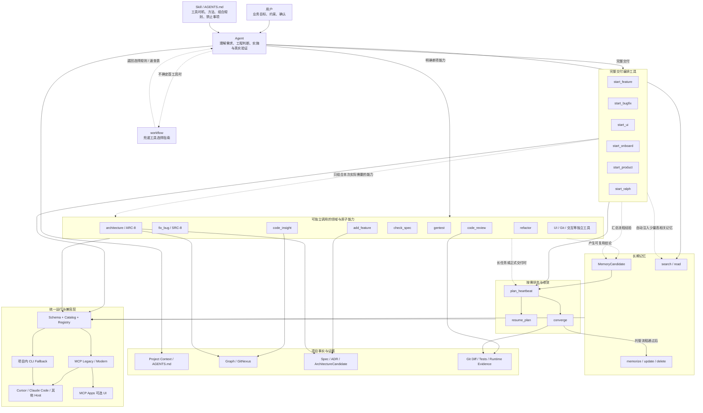

# MCP Probe Kit 软件交付系统 V1 最终需求与验收基线

> 文档状态：V1 最终需求基线；`4.0.0` 已正式发布，本文同时保留 V1 基线与当前稳定版实现口径。
>
> 当前稳定版：`mcp-probe-kit@4.0.0`，npm `latest`；主分支 `main`。
>
> V1 兼容基线：Full 33 个；`4.0.0` 当前模型可见工具：Full 34 个。
>
> App-only 隐藏动作：1 个；目标唯一可调用工具名总数：35 个。
>
> 目标：让不同模型、不同 IDE、不同 Agent，在任何项目中都按照一致、可恢复、可验证、可审计、可维护、可学习的工程纪律交付软件。
>
> 核心原则：Agent 负责工程判断和实施，MCP Probe Kit 负责提供统一方法、项目证据、过程状态、验证闭环和长期记忆。

本文同时定义：

- 产品边界；
- 工具数量与可见性；
- 全部工具的当前实现、目标效果和修改范围；
- `fix_bug` 的 SRC-8 方法；
- `architecture` 的 ARC-8 方法；
- Plan、Converge 和 Memory 闭环；
- 完整组合流程；
- 渐进式开发阶段；
- 开发完成后的验收条件。

---

## 1. 产品定位

MCP Probe Kit 不是代码生成器，也不替代 Agent 的工程判断。

它解决的是以下实际问题：

1. Agent 收到需求后直接写代码，没有先理解项目和影响范围。
2. 不同模型、IDE 和 Agent 的工作方式不一致，交付质量依赖模型临场发挥。
3. 长任务中断或切换 Agent 后，计划、进度、证据和未决问题丢失。
4. Agent 只证明“代码写完”，没有证明需求、测试、审查和真实运行已经闭环。
5. 已经验证过的架构决策、Bug 根因、失败方案和兼容经验无法被后续 Agent 复用。
6. 同一个问题在不同会话中重复排查、重复踩坑、重复破坏既有约束。

产品最终提供四项核心能力：

```text
指导：让 Agent 先理解、分析影响、制定计划。
状态：让任务可中断、可恢复、可追踪。
验证：让完成结论有规格、测试、审查和运行证据。
记忆：让验证过的经验被后续任务和其他 Agent 复用。
```

---

## 2. V1 明确不做什么

- 不由 MCP 自动判断需求属于 L0、L1、L2 或 L3。
- 不让规则引擎替 Agent 判断业务复杂度和架构优劣。
- 不要求所有任务都走重型流程。
- 不建立庞大的中央 Project Digital Twin 数据库。
- 不新增一组 `start_architecture`、`check_architecture`、`architecture_drift` 等彼此割裂的工具；只新增一个统一的 `architecture` 工具，使用不同 mode 覆盖评估、设计、校验和漂移检查。
- 不宣称可以在所有 IDE 中阻止 Agent 直接修改文件。
- 不把普通调试过程、临时日志和未经验证的猜测写入长期记忆。
- 不改名、不删除现有 33 个模型可见工具；目标模型可见工具面在独立兼容阶段新增 1 个 `architecture`，最终为 34 个；App-only 隐藏动作另计 1 个。

---

## 3. Agent、MCP 和用户的职责

### 3.1 Agent 负责

- 理解用户真正要解决的问题；
- 阅读项目上下文、代码、图谱、历史记忆和现有测试；
- 判断受影响模块、接口、数据和兼容范围；
- 提出实现方案、迁移方案和回滚方案；
- 实际修改代码、运行测试和修复问题；
- 对自己的判断提供证据；
- 在确实缺少业务事实时询问用户。

### 3.2 MCP Probe Kit 负责

- 提供清晰的工具合同、调用边界和兜底工具选择指南，供 Agent 判断下一步；
- 自动召回与当前任务相关的历史经验；
- 提供项目上下文、调用链和影响范围证据；
- 要求 Agent 完成统一的任务分析；
- 将分析编译成可恢复的执行计划；
- 保存每个步骤的状态、证据、revision 和未决项；
- 检查规格、测试、审查和收敛证据是否齐全；
- 发现 Agent 声明与真实 diff、契约或测试不一致时提出阻断；
- 只在收敛通过后允许正式沉淀长期记忆。

### 3.3 用户负责

- 提供业务目标和关键限制；
- 确认代码和项目中无法推导的业务事实；
- 对重大取舍、不可逆变化和高风险迁移作出决定；
- 不需要选择流程等级，也不需要记住所有 MCP 工具。

---

## 4. 工具总体设计

V1 先冻结现有 33 个模型可见工具的兼容基线，再以独立提交新增 1 个统一架构工具 `architecture`。目标模型可见工具面为 34 个，连同 App-only 隐藏动作后唯一可调用工具名总数为 35 个。

工具职责和调用方式必须分开理解，禁止把“原子能力”“可组合能力”和“必须被编排”混为一谈：

```text
workflow
  仅在 Agent 不确定首个工具时提供工具选择指南；不做自然语言意图识别

start_*
  场景流程编排器：只组合该场景实际需要的能力，生成 Delegated Plan

fix_bug / code_insight / architecture / check_spec / gentest / code_review ...
  原子或领域能力：可以被 Agent 直接调用；其中一部分也可以被 start_* 组合

plan_heartbeat / resume_plan / converge
  跨流程通用的状态与收敛能力

Memory 工具
  跨流程通用的召回、候选、沉淀和维护能力
```

其中 `start_*` 不是意图识别器，也不是所有工具的总入口。任务类型由 Agent 根据用户上下文和 Skill 判断；`workflow` 只是可选兜底。`start_*` 只在用户需要完整交付流程时，把已经选定场景所需的部分能力按顺序组合起来。

三个概念必须严格区分：

```text
原子能力
  工具职责单一，可以独立完成一次明确任务

可组合能力
  既可以独立调用，也可以作为某个 start_* 流程中的一个步骤

被编排能力
  仅指在某一次具体 Delegated Plan 中实际被 start_* 选中的能力
```

因此，原子能力不等于必须被编排，可组合也不等于每次都要进入 `start_*`。

典型关系：

```text
start_bugfix 编排 fix_bug
start_feature 编排 add_feature / check_spec / estimate / gentest / code_review
start_ui 编排 ui_search / ui_design_system / gentest / code_review
```

但以下直接调用同样是正常路径，不需要先经过任何 `start_*`：

```text
只想理解代码或影响范围 → code_insight
只想做根因分析 → fix_bug
只想检查现有规格 → check_spec
只想做架构评估或设计 → architecture
只想生成测试建议 → gentest
只想审查当前 diff → code_review
只想查询或维护记忆 → Memory 工具
只想生成 Git 工作报告 → git_work_report
```

Agent 是否使用 `start_*`，取决于当前目标是“完成一个完整交付流程”，还是“执行一个明确的单项能力”。

### 4.1 工具数量与可见性口径

工具数量必须区分“模型可见工具”和“App-only 隐藏动作”，禁止再用一个数字混合表达。

| 工具面 | V1 兼容基线 | 4.0.0 当前 | 说明 |
|---|---:|---:|---|
| Compact 模型可见 | 23 | 24 | 默认紧凑工具集 |
| Compact + Memory | 29 | 30 | 紧凑工具集开启 Memory |
| Full 模型可见 | 33 | 34 | 完整兼容工具集 |
| MCP Apps 协商下模型可见 | 29 | 30 | App 能力开启时，模型仍只看到允许的公开工具 |
| App-only 隐藏动作 | 1 | 1 | `list_memory_assets`，仅供 Memory Center 调用 |
| 唯一可调用工具名总数 | 34 | 35 | 模型可见工具加 App-only 动作去重后的总数 |

V1 兼容基线记录（历史口径）：

```text
compact = 23
compactWithMemory = 29
full = 33
appsRaw = 29
tool contract audit = 38 / 38 passed
```

目标数量表达必须统一为：

```text
模型可见正式工具：34 个
App-only 隐藏动作：1 个
唯一可调用工具名总数：35 个
```

### 4.2 最终逻辑架构



### 4.3 全量工具实现与目标效果矩阵

下表是开发前的完整工具清单。`architecture` 是本期唯一新增的模型可见工具；`list_memory_assets` 是现有 App-only 隐藏动作。

| # | 工具 | 类型 | 当前实现位置 | 当前实现效果 | V1 最终效果与修改要求 |
|---:|---|---|---|---|---|
| 1 | `workflow` | 兜底工具选择指南 | `src/tools/workflow.ts`、`src/lib/dev-workflow.ts` | `scenario=auto` 只返回 `selectionGuide` / `agentSelectionRules`，不从自然语言猜 `firstTool`；显式 `scenario` 返回确定性场景指南，并同步 Skill | 保持可选；Agent 根据完整对话、Skill 和 tool descriptions 自主选择工具；`workflow` 只在拿不准时辅助，不执行工具、不维护任务状态、不判断风险等级 |
| 2 | `start_feature` | 完整交付编排 | `src/tools/start_feature.ts` | 注入 Memory、图谱、规格布局、规格草稿、`check_spec` 和 `estimate`，返回功能 Plan | 补齐影响分析、架构按需、实现、真实测试、`code_review`、`converge` 和 Memory 闭环；不复制底层工具方法 |
| 3 | `start_bugfix` | 完整交付编排 | `src/tools/start_bugfix.ts` | 组合 Memory、项目上下文、图谱、规格闸门和共享 SRC-8 Plan | 明确只编排 `fix_bug` 的 SRC-8；补齐修复、回归、review、converge 和正式记忆沉淀；不维护第二套八步法 |
| 4 | `start_ui` | 完整交付编排 | `src/tools/start_ui.ts` | 生成视觉方向、设计系统、结构搜索、关键页面实现、桌面/移动截图、视觉评审和迭代步骤 | 所有模式统一正式 DelegatedPlanContract；补交互状态、真实测试、review、converge 和 Memory；不得把 Agent 文件操作伪装为 MCP 工具 |
| 5 | `start_onboard` | 项目上手编排 | `src/tools/start_onboard.ts` | 当前主要编排 `init_project_context` | 扩展为项目上下文、`code_insight`、构建/测试/运行命令、Memory、关键文件和已知问题导航；不强制进入代码交付流程 |
| 6 | `start_product` | 产品编排 | `src/tools/start_product.ts` | 已有正式 Plan，生成 PRD、原型文档、设计系统、调用 `start_ui` 生成 HTML 原型并更新上下文 | 保留闭环；接入可恢复状态、产物一致性和最终产品验收；不强制代码 review，除非进入真实代码实现 |
| 7 | `start_ralph` | 长周期循环编排 | `src/tools/start_ralph.ts` | 生成 Ralph 提示、脚本、安全限制、进度模板和停止条件，不后台自动执行 | 接入 Plan、每轮 heartbeat、测试证据、重复输出检测和最终 converge；每轮只做一个可验证变更，禁止失控后台运行 |
| 8 | `init_project` | 项目初始化 | `src/tools/init_project.ts` | 实际写入 Skill 与 `AGENTS.md`，其余结构作为 `pendingFiles` 交给 Agent | 保留真实写入边界；明确哪些文件 MCP 已写、哪些由 Agent 落盘；不伪称项目骨架全部自动生成 |
| 9 | `init_project_context` | 项目事实初始化 | `src/tools/init_project_context.ts` | 写入 Skill、`AGENTS.md`、layout manifest、索引和 delegated 落盘计划；分类文档和图谱由 Agent完成 | 保留渐进兼容；不覆盖已有上下文；稳定输出项目技术栈、架构、命令、测试和图谱入口 |
| 10 | `add_feature` | 规格能力 | `src/tools/add_feature.ts` | 生成 flat 或 parent-child 规格模板、草稿和落盘指导 | 保持可独立调用；只在范围与布局明确后使用；规格覆盖目标、非目标、影响、接口、数据、迁移、回滚、验收和测试 |
| 11 | `check_spec` | 规格校验 | `src/tools/check_spec.ts` | 检查规格文件、章节、占位符和 parent-child 关联 | 按任务实际要求检查完整性、可测试性、影响、契约、数据、迁移、回滚和未决项；不强制所有项目同一重型模板 |
| 12 | `estimate` | 估算 | `src/tools/estimate.ts` | 根据描述、任务和上下文给出故事点、工时和风险估算 | 保留为计划参考；输出依据、不确定性和假设；不得作为承诺工期或自动风险分类器 |
| 13 | `code_insight` | 代码事实能力 | `src/tools/code_insight.ts`、`src/lib/gitnexus-bridge.ts` | 支持 context/impact/auto、符号消歧、图谱证据、影响面和可选文档 Plan | 保留；图谱不可用时明确 degraded；输出事实、来源、歧义和置信度；不替 Agent选择方案 |
| 14 | `fix_bug` | Bug 领域能力 | `src/tools/fix_bug.ts`、`src/lib/src8-guidance.ts`、`src/lib/src8-prompt.ts` | 提供 SRC-8、真因工作表、归因层、门禁、BugAnalysis 和子计划 | 成为 SRC-8 唯一公共事实源；支持独立调用和被 `start_bugfix` 编排；连续三次失败退回边界/真因阶段 |
| 15 | `architecture` | 架构领域能力 | **新增**：`src/tools/architecture.ts`、`src/lib/architecture-method.ts` | 当前不存在 | 实现 ARC-8；支持 `assess|design|validate|drift`；输出事实、根因、不变量、候选方案、权衡、目标边界、数据所有权、迁移、回滚、验证、ADR/ArchitectureCandidate 和 MemoryCandidate |
| 16 | `gentest` | 测试设计 | `src/tools/gentest.ts` | 读取代码或文件，识别项目现有测试框架，返回测试策略、场景和候选代码 | 保留；禁止擅自引入新测试框架；明确“生成测试建议”不等于“测试已执行通过” |
| 17 | `code_review` | 代码审查 | `src/tools/code_review.ts` | 当前为 guidance-only，注入代码/文件，由 Agent按清单生成问题 | 增强真实 Git diff、Plan 声明范围、接口/Schema/数据变化、架构偏移和测试证据对比；仍不伪称服务端已完成静态扫描 |
| 18 | `refactor` | 重构能力 | `src/tools/refactor.ts` | 返回问题分析、分步重构建议、质量约束和测试指导 | 保持独立调用；架构变化时按需使用 `architecture`；必须包含行为保护、分阶段验证、迁移、回滚和旧代码清理 |
| 19 | `gencommit` | Git 辅助 | `src/tools/gencommit.ts` | 根据实际变更生成 Conventional Commit 建议 | 保留；可引用 plan/spec 和测试摘要；只生成文本，不自动 commit、push、tag 或 release |
| 20 | `git_work_report` | Git 报告 | `src/tools/git_work_report.ts` | 生成读取 Git 历史和 diff 的指导，不直接执行 Git 收集 | 保留；Agent 必须基于真实 commit 和 diff 生成日报/周报，禁止根据提交标题推测工作内容 |
| 21 | `ui_design_system` | UI 领域能力 | `src/tools/ui-ux-tools.ts` | 生成视觉方向、设计 token、组件规则和兼容字段 | 保持独立调用与流程复用；输出稳定视觉契约，不直接实施页面 |
| 22 | `ui_search` | UI 数据检索 | `src/tools/ui-ux-tools.ts` | 搜索本地 UI/UX 数据集，支持结构、模板、组件、主题等模式 | 保留；只提供候选模式和证据，不替 Agent作最终设计选择 |
| 23 | `sync_ui_data` | UI 数据维护 | `src/tools/ui-ux-tools.ts` | 检查上游版本，下载并写缓存；`check_only` 不联网不写入；新数据下次启动生效 | 保留明确副作用边界；只在显式调用时联网和写缓存；当前会话不热切换 |
| 24 | `search_memory` | Memory 检索 | `src/tools/search_memory.ts`、`src/lib/memory-client.ts` | 语义检索和 browse，默认过滤过期、替代和撤回资产 | 保留；显示来源、状态、适用范围和更新时间；当前项目事实永远优先 |
| 25 | `read_memory_asset` | Memory 精读 | `src/tools/read_memory_asset.ts` | 按 `asset_id` 读取记忆全文 | 保留；高影响决策不得只依赖搜索摘要 |
| 26 | `memorize_asset` | Memory 写入 | `src/tools/memorize_asset.ts` | 写入成功或负面记忆，支持 evidence、applicability、生命周期、过期和替代关系 | 托管交付流程必须 `converge passed=true` 后调用；用户明确进行独立记忆管理时可直接调用，但必须满足证据和边界要求 |
| 27 | `update_memory_asset` | Memory 更新 | `src/tools/update_memory_asset.ts` | 按 ID 原位更新，支持状态、expiry、supersede 关系 | 保留；新结论取代旧结论时应形成明确替代关系，避免两个冲突的 active 资产 |
| 28 | `delete_memory_asset` | Memory 删除 | `src/tools/delete_memory_asset.ts` | 要求 `confirm=true` 后删除资产 | 保留；删除前应读取确认；用于错误、重复、无价值或不应保留的资产 |
| 29 | `scan_and_extract_patterns` | Memory 候选提取 | `src/tools/scan_and_extract_patterns.ts` | 扫描仓库并输出可复用模式与反模式候选 | 只生成 MemoryCandidate，绝不自动写长期记忆 |
| 30 | `plan_heartbeat` | 状态写入 | `src/tools/plan_heartbeat.ts`、`src/plans/plan-heartbeat.ts`、`src/plans/plan-store.ts` | 原子写入 `.mcp-probe-kit/plans/<plan_id>.json`，保存步骤、证据、revision 和未决项 | 增加可选 `declaredScope`、`artifacts`、`memoryCandidates`、`architectureCandidates`、`acceptanceResults`、`runtimeEvidence`；保持旧 Plan 可读 |
| 31 | `resume_plan` | 状态恢复 | `src/tools/resume_plan.ts`、`src/plans/plan-resume.ts` | 根据依赖计算 ready/blocked steps 并恢复状态 | 新 Agent 无需旧对话即可继续；恢复候选记忆、架构候选、证据、revision 和下一动作 |
| 32 | `converge` | 交付收敛 | `src/tools/converge.ts`、`src/plans/plan-converge.ts` | 当前检查步骤、未决项和固定证据种类 | 改为由 Plan 声明 `requiredEvidenceKinds`、`qualityGates`、`completionCriteria`；按任务实际需求收敛，托管流程通过后返回 `memoryWriteAllowed` |
| 33 | `ask_user` | 交互辅助 | `src/tools/ask_user.ts` | 生成单个或多个结构化问题、上下文和选项 | 保留 Full 兼容；支持 Host 无原生 elicitation 时使用；普通 Agent也可直接向用户提问 |
| 34 | `interview` | 需求访谈 | `src/tools/interview.ts` | 提供结构化访谈、多轮问题和需求收敛 | 保留；仅在需求确实模糊时使用，不成为每个任务必经步骤 |
| 35 | `list_memory_assets` | App-only 隐藏动作 | `src/tools/list_memory_assets.ts`、`src/server/tool-registry.ts` | 为 Memory Center 分页浏览记忆，支持类型、状态、项目和标签过滤；不出现在模型 `tools/list` | 保持 App-only；不得竞争模型工具面；无 Apps 时不影响核心 Memory 功能 |

### 4.4 每个工具的统一实现契约

每个模型可见工具必须同时具备：

```text
Input Schema
Tool Catalog Entry
Handler / Tool Implementation
Output Schema
Skill Route / Usage Guidance
Tool Visibility
CLI 调用路径
Legacy Protocol
Modern Protocol
单元测试与契约测试
```

统一注册链：

```text
Schema
→ Catalog
→ Registry
→ MCP / CLI
→ Skill
→ Docs
→ Contract Audit
```

任何一项缺失均视为工具未完整实现。禁止出现：

- Catalog 有工具但没有 Schema；
- Schema 有工具但没有 Handler；
- 文本中引用不存在的 phantom tool；
- CLI 与 MCP 使用不同的实现语义；
- Legacy 与 Modern 返回不同核心结构；
- App-only 工具泄漏到模型 `tools/list`。

---

## 5. 编排、路由与架构入口

### 5.1 `start_feature`

用途：新功能、功能增强、跨模块能力和大版本功能改造的首选入口。

输入必须包含当前对话已经确认的完整需求，而不是“继续”“开始”等短句。

内部流程：

```text
恢复完整任务意图
→ 自动检索相关 Memory
→ 检查项目上下文是否可用
→ 必要时使用 code_insight 获取影响证据
→ 要求 Agent 完成 Task Assessment
→ 确定规格布局和验收标准
→ 生成 Delegated Plan
→ 首次 plan_heartbeat 建立检查点
```

Task Assessment 至少回答：

1. 当前行为和目标行为分别是什么？
2. 涉及哪些入口、模块、调用链和数据路径？
3. 是否改变公共接口、Schema、数据口径或状态所有权？
4. 是否需要兼容、迁移、回滚或用户确认？
5. 哪些测试和真实场景必须保持正常？

`start_feature` 不替 Agent 判断答案，只确保这些问题没有被跳过，并把答案写入计划和规格。

标准后续链路：

```text
start_feature
→ plan_heartbeat
→ add_feature
→ check_spec
→ Agent 实现
→ gentest
→ 运行测试
→ code_review
→ converge
→ memorize_asset
→ gencommit
```

### 5.2 `start_bugfix`

用途：Bug、报错、异常、不生效、回归和行为不一致。

`start_bugfix` 是完整 Bug 交付流程的编排器，不拥有 SRC-8 方法论本身。

SRC-8（Software Root-Cause 8-step，受丰田 TBP 启发）的唯一能力归属是 `fix_bug`。`start_bugfix` 负责组合：

```text
Memory Recall
→ 项目上下文与图谱
→ fix_bug / SRC-8 子流程
→ 规格闸门（按需）
→ Plan 状态
→ code_review
→ converge
→ Memory 正式沉淀
```

实现上可以把 `fix_bug` 返回的 SRC-8 子步骤展开到顶层 Delegated Plan，便于 Agent 顺序执行和 heartbeat；但步骤定义、门禁、工作表和输出 Schema 必须来自 `fix_bug` 的同一事实源，`start_bugfix` 不得维护另一份八步法。

下面列出的 SRC-1 至 SRC-8，是 `start_bugfix` 所编排的 `fix_bug` 子流程；规范性定义见 6.3。

#### SRC-1 明确差距

- 写清理想行为、实际行为和可观察差距；
- 区分失败、停滞、性能下降、回归和未生效；
- 禁止只记录“坏了”“卡了”“有问题”。

#### SRC-2 收敛边界

- 建立发生前、发生中、发生后的时间线；
- 读取日志、堆栈、源码和运行证据；
- 必要时调用 `code_insight` 定位入口、调用链和影响范围；
- 从 code、runtime、data_contract、integration、agent_behavior、environment 六层收敛问题边界。

#### SRC-3 验收契约

- 在修复前定义“什么叫修好”；
- 优先建立 failing test，或者可重复的复现命令、手动步骤；
- 明确回归范围和不得破坏的现有行为。

#### SRC-4 把握真因

Agent 必须完成真因工作表：

```text
4a 假设清单：至少 2 个候选假设
4b 排除矩阵：证据、反证和结论
4c 对比分叉：成功样本 vs 失败样本；没有样本则记录 evidence gap
4d 5 Why：至少 3 层，每层绑定观察事实
4e 真因陈述：形成可验证的因果句；复杂问题记录主因和贡献因子
```

SRC-4 没有闭合前禁止修改代码。猜测、症状描述和“某 SDK 有 Bug”不能直接作为真因。

#### SRC-5 制定对策

- 对策必须针对真因，而不是增加兜底掩盖症状；
- 优先最小 patch、最少文件和最少新概念；
- 评估有效性、可行性、副作用和回归风险；
- 如果对策改变模块边界、数据所有权或公共契约，调用 `architecture mode=assess|design`。

#### SRC-6 贯彻修复

- SRC-1 至 SRC-5 和复现门禁完成后才能改代码；
- 一次只验证一个主要假设；
- 实际修改必须限制在已确认的 Bug 范围；
- 连续三次修复仍失败时返回 SRC-2 或 SRC-4，不得继续盲试。

#### SRC-7 评价双轨

- 结果轨：重跑原复现、failing test 和回归测试；
- 过程轨：复盘哪条假设可以更早排除、哪一步证据不足；
- 对涉及架构的修复调用 `architecture mode=validate|drift`；
- 未验证不得声明修复完成。

#### SRC-8 巩固传播

- 补回归测试锁定边界；
- 排查同类模块和相同路径是否存在同源问题；
- 生成 MemoryCandidate，至少包含【现象】【根因】【修复】【验证】；
- 失败方案、被证伪根因和新发现的回归同样形成负面候选；
- 只有 `converge passed=true` 后才能调用 `memorize_asset` 正式沉淀。

整体内部流程：

```text
恢复错误现象和预期行为
→ 自动检索相似 Bug、负面经验和历史根因
→ 生成 SRC-8 Delegated Plan
→ 首次 plan_heartbeat 附完整 Plan 建立检查点
→ SRC-1 明确差距
→ plan_heartbeat
→ SRC-2 收敛边界（code_insight 按需）
→ plan_heartbeat
→ SRC-3 建立验收契约
→ plan_heartbeat
→ SRC-4 真因工作表闭合
→ plan_heartbeat
→ SRC-5 制定最小对策（architecture 按需）
→ plan_heartbeat
→ SRC-6 贯彻修复
→ plan_heartbeat
→ SRC-7 结果与过程双评（architecture validate/drift 按需）
→ plan_heartbeat
→ SRC-8 回归保护与 MemoryCandidate
→ plan_heartbeat
```

Bug 未能复现时，不允许直接把猜测当作根因。可以记录假设，但必须明确验证方式。

标准后续链路：

```text
start_bugfix
→ plan_heartbeat
→ 严格执行 SRC-1~SRC-5
→ architecture（架构根因或架构对策时）
→ SRC-6 Agent 修复
→ gentest + SRC-7 回归验证
→ code_review
→ converge
→ SRC-8 memorize_asset（根因、修复、失败方案或错误根因）
→ gencommit
```

### 5.3 `start_ui`

用途：页面、组件、交互、响应式、视觉优化和设计系统相关开发。

内部流程：

```text
恢复完整 UI 目标
→ 自动检索项目设计规范、历史 UI 决策和已知问题
→ 读取现有页面和组件结构
→ 需要时调用 ui_search / ui_design_system
→ Agent 明确内容层级、交互状态、响应式和无障碍要求
→ 生成实现与验收计划
→ plan_heartbeat 建立检查点
```

UI 验收不只检查代码，还应包含：

- 关键页面截图或视觉证据；
- 交互状态；
- 空状态、加载状态和错误状态；
- 移动端或响应式表现；
- 不破坏现有设计系统。

标准后续链路：

```text
start_ui
→ plan_heartbeat
→ ui_search / ui_design_system（可选）
→ Agent 实现
→ gentest
→ 视觉与交互验收
→ code_review
→ converge
→ memorize_asset
→ gencommit
```

### 5.4 `architecture`

用途：当任务涉及模块边界、依赖方向、数据所有权、公共契约、系统拆分、迁移方案或架构漂移时，提供统一的架构工作流。

`architecture` 必须拥有自己的统一方法论，不能只有 `assess|design|validate|drift` 四个操作模式。四个 mode 只是进入同一方法论的不同阶段，不是方法本身。

本项目将该方法定义为 **ARC-8（Architecture Reasoning & Change 8-step，架构推理与变更八步法）**：

#### ARC-1 明确架构问题

- 明确要解决的结构性问题、决策问题或演进目标；
- 明确范围、非目标、业务约束、技术约束和不可逆约束；
- 定义成功标准：什么事实出现后，才能认为架构问题已解决；
- 区分“代码整理”“局部重构”和“真正的架构变化”。

#### ARC-2 重建当前架构事实

- 读取当前代码、项目上下文、图谱、运行方式、部署方式和相关 Memory；
- 还原模块边界、调用链、数据流、状态流、公共契约和外部依赖；
- 所有结论标记为 `fact`、`inference` 或 `unknown`；
- 图谱或运行证据缺失时必须明确降级，禁止用猜测补全事实。

#### ARC-3 定位结构性根因与保护不变量

- 判断问题是否来自边界错误、依赖倒置、循环依赖、数据所有权不清、重复事实源、契约泄漏、生命周期错位或迁移缺失；
- 明确必须保护的业务行为、数据一致性、兼容性、性能、权限和运维不变量；
- 区分症状、直接原因、结构性根因和贡献因素；
- 若只是局部实现缺陷，应退出架构流程，改用 `fix_bug` 或 `refactor`。

#### ARC-4 形成候选方案

- 对实质性架构决策形成至少两个可比较方案；
- 在合理时包含“保持现状/最小演进”方案，避免把大改当成唯一答案；
- 每个方案必须说明边界、依赖、数据所有权、契约和过渡方式；
- 不允许只给出抽象口号或只画目标图而不说明现实迁移路径。

#### ARC-5 权衡并作出决策

- 按正确性、一致性、可维护性、演进性、性能、可观测性、兼容性、实施成本和回滚难度比较方案；
- 记录关键假设、证据、被拒绝方案及拒绝理由；
- 由 Agent 给出推荐方案和选择依据，MCP 只检查论证是否完整；
- 生成 ADR/ArchitectureCandidate，而不是宣称存在绝对最优方案。

#### ARC-6 设计目标架构与过渡路径

- 定义目标模块边界、允许和禁止的依赖方向；
- 定义数据所有者、读写路径、事务边界和一致性规则；
- 定义公共接口、Schema、事件、文件格式和兼容策略；
- 拆分可独立验证、可暂停、可回滚的实施阶段；
- 明确迁移、双写/兼容期（如有）、回滚、观测、旧代码清理和最终收口条件。

#### ARC-7 实施前与阶段性验证

- 用关键业务场景、异常场景和数据流走查目标设计；
- 检查影响矩阵、消费者、迁移顺序、回滚可行性、测试和观测是否完整；
- 重大阶段完成后重新执行 `validate`，确认事实没有变化、假设仍成立；
- 未覆盖公共契约、数据迁移或保护不变量时，不得进入下一阶段。

#### ARC-8 漂移核验与经验固化

- 将真实 diff、当前图谱、运行结果与已确认目标设计逐项对照；
- 识别越界依赖、重复事实源、未登记契约变化、临时兼容残留和未清理旧路径；
- 对合理偏差更新 ADR，对不合理偏差退回设计或实施阶段；
- 形成 ArchitectureResult 和 MemoryCandidate；仅在 `converge passed=true` 后正式沉淀。

ARC-8 的阶段门禁：

```text
ARC-2 当前事实未建立
→ 不得进入目标设计

ARC-3 未明确结构性根因和保护不变量
→ 不得选择方案

ARC-5 未记录方案权衡和选择依据
→ 不得把方案标记为已确认

涉及数据、公共契约或持久化变化但 ARC-6 缺少迁移与回滚
→ validate 必须失败

未对真实 diff / 图谱执行 ARC-8
→ 使用过 architecture 的正式代码交付不得 converge
```

只增加一个工具，避免把架构能力拆成多个孤立入口。工具使用以下 mode：

| mode | 作用 | 典型调用时机 |
|---|---|---|
| `assess` | 基于当前代码、图谱和 Memory 判断架构影响与问题边界 | 新功能、Bug 或重构发现跨模块影响时 |
| `design` | 形成目标边界、依赖方向、数据所有权、契约、迁移和回滚方案 | 实施前需要作架构设计时 |
| `validate` | 检查拟定方案是否覆盖影响范围、兼容和约束 | 方案完成、写代码前或重大阶段完成后 |
| `drift` | 对照已确认设计和真实 diff，检查越界依赖、重复事实源和未登记变化 | 实施后、`converge` 前 |

四种 mode 与 ARC-8 的对应关系：

| mode | 主要执行的 ARC-8 阶段 | 前置要求 |
|---|---|---|
| `assess` | ARC-1～ARC-3 | 提供完整目标和项目范围 |
| `design` | ARC-4～ARC-6 | 已有 ARC-1～ARC-3 结果，或调用时提供等价事实证据 |
| `validate` | 复核 ARC-1～ARC-7 | 提供待验证的 ArchitectureCandidate/ADR/Plan |
| `drift` | ARC-7～ARC-8 | 提供已确认设计及真实 diff、图谱或运行证据 |

完整架构变更通常执行：

```text
architecture mode=assess
→ architecture mode=design
→ plan_heartbeat
→ 分阶段实施
→ architecture mode=validate（阶段性）
→ architecture mode=drift（最终）
```

单项架构评估可以只执行 `assess`；单项方案审查可以直接执行 `validate`，但必须携带其依赖的事实和设计证据。

#### `architecture` 输入契约

```json
{
  "mode": "assess | design | validate | drift",
  "description": "本次架构任务的完整目标",
  "project_root": "目标项目绝对路径",
  "scope": ["可选：模块、目录、服务或数据域"],
  "constraints": ["已确认业务与技术约束"],
  "non_goals": ["本次明确不处理的内容"],
  "baseline": "可选：已有 ADR、ArchitectureCandidate、Plan 或设计正文",
  "diff": "可选：validate/drift 使用的真实 diff 或 revision 范围",
  "runtime_evidence": ["可选：运行结果、日志、指标或验收证据"],
  "save_to_docs": false
}
```

输入规则：

- `description` 必须是完整目标，不接受只有“继续”“优化架构”等无上下文短句；
- `project_root` 必须解析到真实项目根目录；
- `design` 缺少 ARC-1～ARC-3 事实时应返回缺口，而不是直接生成目标架构；
- `validate` 必须提供待验证设计；
- `drift` 必须提供已确认设计及真实实现证据；
- `save_to_docs=true` 只返回明确的 Agent 落盘计划，不直接重写大量项目文档。

#### `architecture` 结构化输出契约

```json
{
  "mode": "assess",
  "methodology": "arc8",
  "arc8Status": {
    "completedSteps": [],
    "blockedSteps": [],
    "nextStep": "arc-1"
  },
  "problem": {
    "goal": "",
    "scope": [],
    "nonGoals": [],
    "successCriteria": [],
    "constraints": []
  },
  "currentFacts": [
    {
      "statement": "",
      "classification": "fact | inference | unknown",
      "evidence": []
    }
  ],
  "structuralCauses": [],
  "protectedInvariants": [],
  "alternatives": [],
  "tradeoffMatrix": [],
  "decision": {
    "recommended": "",
    "rationale": [],
    "rejectedAlternatives": [],
    "assumptions": []
  },
  "targetArchitecture": {
    "boundaries": [],
    "allowedDependencies": [],
    "forbiddenDependencies": [],
    "dataOwnership": [],
    "publicContracts": [],
    "protectedBehaviors": []
  },
  "transitionPlan": {
    "stages": [],
    "migration": [],
    "compatibility": [],
    "rollback": [],
    "observability": [],
    "cleanup": []
  },
  "validation": {
    "passed": false,
    "gaps": [],
    "driftFindings": []
  },
  "architectureCandidate": {},
  "adrCandidate": {},
  "memoryCandidate": {},
  "metadata": {
    "plan": {},
    "graphStatus": "available | degraded | unavailable",
    "warnings": []
  }
}
```

不同 mode 可以返回字段子集，但字段语义必须一致，不得为四种 mode 各自创建互不兼容的输出模型。

#### `architecture` 实现结构

```text
src/tools/architecture.ts
  参数解析、调用共享方法、组装 MCP 响应

src/lib/architecture-method.ts
  ARC-8 步骤、门禁、mode 映射、候选方案与输出构建

src/schemas/architecture-tools.ts
  输入 Schema

src/schemas/output/architecture-tools.ts
  输出 Schema

src/tools/__tests__/architecture.unit.test.ts
  方法、门禁和输出契约单测

src/tools/__tests__/architecture.integration.test.ts
  图谱、Memory、Plan、diff 和降级路径集成测试
```

同时接入：

```text
src/schemas/index.ts
src/server/tool-catalog.ts
src/server/tool-registry.ts
src/server/tool-visibility.ts
src/lib/output-schema-registry.ts
src/lib/mcp-tool-skill-registry.ts
src/lib/dev-workflow.ts
src/lib/dev-workflow-routing.ts
```

#### `architecture` 专项验收场景

1. `assess` 能基于真实项目和图谱输出 fact/inference/unknown，而不是编造依赖。
2. 图谱不可用时返回 degraded，并仍可使用代码、manifest 和 diff 证据继续。
3. `design` 缺少 ARC-1～ARC-3 结果时返回明确缺口，不直接越过门禁。
4. 涉及数据或公共契约变化但没有迁移和回滚时，`validate.passed=false`。
5. `drift` 能发现新增越界依赖、重复事实源、未登记契约变化和旧路径残留。
6. 合理实现偏差可生成 ADR 更新候选，不合理偏差要求退回设计或实施阶段。
7. `architecture` 可独立调用，不依赖任何 `start_*`。
8. `start_feature`、`start_bugfix`、`refactor` 引用同一 ARC-8 核心，不复制步骤文本和门禁。
9. Compact、Full、Legacy、Modern、CLI fallback 对 `architecture` 使用同一 Schema 和核心语义。
10. 新增工具后工具面严格为 Compact 24、Compact+Memory 30、Full 34；App-only 隐藏语义不变。

`architecture` 不替 Agent 决定哪个方案绝对最优。它负责：

- 自动检索相关架构决策、失败重构和兼容经验；
- 调用或消费 `code_insight` 的当前结构和影响证据；
- 要求 Agent 明确当前问题、目标结构和选择依据；
- 结构化记录模块边界、依赖方向、数据所有权和公共契约；
- 明确必须保护的既有行为；
- 给出迁移、回滚、验证和旧代码清理要求；
- 生成 ADR/ArchitectureCandidate，并写入 Plan；
- 在 `converge` 通过后沉淀经过验证的架构决策或反模式。

标准输出至少包含：

```text
ARC-8 当前阶段与完成状态
→ 架构问题、范围、非目标和成功标准
当前架构事实与证据
→ 当前问题和根因
→ 保护不变量
→ 候选方案及权衡矩阵
→ 推荐方案和被拒绝方案理由
→ 目标模块边界
→ 允许与禁止的依赖方向
→ 数据所有者和读写路径
→ 公共契约及兼容要求
→ 必须保护的行为
→ 实施阶段、迁移与回滚
→ 验证清单
→ MemoryCandidate / ADR Candidate
```

`architecture` 是 ARC-8 的唯一公共事实源。`start_feature`、`start_bugfix` 和 `refactor` 只能按需调用或引用 ARC-8 结果，不得各自复制一套架构步骤、门禁和输出定义。

标准后续链路：

```text
search_memory
→ code_insight mode=impact
→ architecture mode=assess
→ architecture mode=design
→ plan_heartbeat
→ Agent 实施
→ architecture mode=validate|drift
→ code_review
→ converge
→ memorize_asset（架构决策、迁移经验或反模式）
```

以下情况不要求调用 `architecture`：

- 单文件文案或样式修改；
- 不改变公共行为的局部实现；
- 根因和影响范围明确的单模块修复；
- 纯只读查询。

### 5.5 `refactor`

用途：整理代码、拆分模块、降低耦合、收口数据所有权和渐进式架构调整。

大范围重构前必须先调用 `code_insight mode=impact`。

内部流程：

```text
检索历史架构决策和失败重构经验
→ code_insight 获取当前结构和影响范围
→ architecture mode=assess 描述当前问题和架构影响
→ architecture mode=design 定义目标边界、数据所有权和必须保护的行为
→ 拆分为可独立验证、可回滚的小步骤
→ 生成阶段计划
→ 每步完成后 plan_heartbeat
```

重构不能只以“代码更整洁”为完成标准，必须证明：

- 外部行为未意外变化；
- 数据口径和唯一事实源没有被破坏；
- 依赖方向得到改善或至少没有恶化；
- 每个阶段可以独立回滚；
- 旧代码在替代完成后有明确清理计划。

标准后续链路：

```text
code_insight
→ architecture mode=assess|design
→ refactor
→ plan_heartbeat
→ 分阶段实现
→ 每阶段测试与 heartbeat
→ architecture mode=validate|drift
→ code_review
→ converge
→ memorize_asset（架构决策和反模式）
→ gencommit
```

### 5.6 `start_onboard`

用途：新仓库、新成员或 Agent 第一次进入项目时建立可靠心智模型。

内部流程：

```text
检查 AGENTS.md 和 docs/project-context
→ init_project_context（缺失或过期时）
→ code_insight 获取入口、模块和关键调用链
→ 读取构建、测试、运行和发布命令
→ 检索项目 Memory
→ 输出项目导航和已知约束
```

可使用 `scan_and_extract_patterns` 生成候选模式，但未经验证不得直接写入长期记忆。

### 5.7 `workflow`

用途：Agent 阅读 Skill 和 tool descriptions 后仍不确定应该使用哪个入口时，提供兜底工具选择指南。

它只负责：

- 在 `scenario=auto` 时展示工具选择规则、相邻能力边界和禁止事项，`firstTool=null`；
- 在 Agent 已经判断出场景并显式传 `scenario` 时，给出该场景的确定性 `firstTool`、参数提示和阶段建议；
- 帮助 Agent 自己判断，必要时提示先向用户澄清。

它不负责：

- 根据任意自然语言自动识别 feature / bugfix / ui / refactor 等意图；
- 代替 Agent 处理多个独立交付之间的语义关系；
- 判断需求风险等级；
- 作为所有任务的强制主入口；
- 替代 `start_*` 的项目分析；
- 阻止 Agent 直接调用明确的入口工具。

---

## 6. 十七个核心执行与记忆工具

### 6.1 `init_project_context`

作用：为现有项目生成或刷新 `AGENTS.md`、项目上下文和图谱基线。

何时使用：

- 第一次进入项目；
- 现有上下文明显过期；
- 大改前找不到可信入口、模块边界和测试命令。

它生成项目事实，不判断架构一定正确。

### 6.2 `code_insight`

作用：提供代码入口、调用链、依赖、影响范围和相关测试证据。

要求：

- 图谱可用时返回图谱证据；
- 图谱不可用时明确降级，不伪造调用关系；
- 输出来源和置信度；
- 结果用于 Agent 判断，不直接替 Agent决定方案。

### 6.3 `fix_bug`

作用：Bug 修复领域能力，拥有 SRC-8 的唯一规范性定义，包括八步清单、真因工作表、门禁、结构化输出和子流程计划。它可以被 Agent 独立调用，也通常由 `start_bugfix` 编排。

职责边界：

- `fix_bug` 定义“Bug 应该怎样分析和修复”；
- `start_bugfix` 定义“完整 Bug 交付还要组合哪些上下文、状态、审查、收敛和记忆步骤”；
- `workflow` 只在 Agent 不确定入口时建议调用 `start_bugfix`；
- 三者不得重复维护 SRC-8 规则。

至少要求：

- SRC-1 理想行为、实际行为和可观察差距；
- SRC-2 时间线、问题边界和归因层；
- SRC-3 failing test、复现命令或手动验收契约；
- SRC-4 至少两个候选假设、排除证据、成功/失败对比、至少三层 5 Why 和真因因果句；
- SRC-5 最小对策、有效性、可行性和回归风险；
- SRC-6 复现门禁通过后再实施；
- SRC-7 结果和过程双轨评价；
- SRC-8 回归保护和 MemoryCandidate。

真因工作表未闭合前不得进入修复；连续三次修复失败后必须退回边界或真因步骤。

`fix_bug` 的规范性产物至少包括：

```text
src8Checklist
rootCauseWorksheet
src8Gate
BugAnalysis Schema
SRC-1~SRC-8 子计划
MemoryCandidate 模板
```

`start_bugfix` 只能复用或展开这些产物，不能在自己的模块中重新定义一套步骤标题、依赖、门禁或证据要求。

### 6.4 `add_feature`

作用：在范围和规格布局已确定后生成规格模板。

它不是大型需求的第一个入口，也不替代 `start_feature`。

规格至少包含：

- 目标与非目标；
- 当前行为与目标行为；
- 功能需求；
- 影响模块；
- 接口和数据变化；
- 兼容、迁移和回滚；
- 验收标准；
- 测试范围；
- 历史经验与已知坑。

小型任务可以使用紧凑规格，不强制生成大量文档。

### 6.5 `check_spec`

作用：写实现代码前检查规格是否足以指导开发和验收。

检查重点：

- 需求是否明确；
- 验收标准是否可测试；
- Agent 是否说明影响范围；
- 接口、数据、兼容和回滚是否遗漏；
- 是否引用了相关历史记忆和项目证据；
- 是否存在未关闭的关键问题。

它检查完整性和一致性，不判断方案是否绝对最优。

### 6.6 `gentest`

作用：为功能、Bug 和重构生成测试策略与测试候选。

应区分：

- 单元测试；
- 受影响模块测试；
- 主链回归；
- 协议、CLI、Host 或 Apps 测试；
- 真实运行或 Agent 验收。

测试文件生成后仍必须真实执行，不能把“已生成测试”当作“测试通过”。

### 6.7 `code_review`

作用：审查实际 diff，而不是只审查 Agent 的计划。

重点检查：

- 实际修改是否超出声明范围；
- 根因是否真正关闭；
- 是否新增重复事实源；
- 接口、Schema 和数据口径是否同步；
- 测试是否覆盖关键行为；
- 是否留下死代码、临时兼容和未处理风险；
- 是否存在安全、权限或隐私问题。

### 6.8 `plan_heartbeat`

作用：保存当前任务的可恢复检查点。

首次调用必须附完整 Delegated Plan，之后每完成、跳过或阻塞一个步骤都要更新。

保存内容：

- 当前步骤；
- 已完成步骤；
- 跳过原因；
- 未决问题；
- 需求、规格、实现、测试和审查证据；
- 当前 Git revision；
- MemoryCandidate；
- 下一步动作。

### 6.9 `resume_plan`

作用：在会话中断、IDE 重启或切换 Agent 后恢复任务。

返回：

- 完整目标；
- 当前步骤；
- 已完成和未完成步骤；
- 最近验证 revision；
- 未决问题；
- 已有证据；
- MemoryCandidate；
- 下一可执行动作。

新 Agent 不应依赖旧对话正文才能继续。

### 6.10 `converge`

作用：最终交付收敛闸门。

至少检查：

- 计划步骤已完成或有合理跳过说明；
- 关键未决问题已关闭；
- 需求或修复目标有证据；
- 规格要求已满足；
- 实现 revision 已记录；
- 测试真实执行且结果可追溯；
- code_review 已完成；
- 真实 Host、CLI、协议或本地 build 验收在需要时已完成；
- MemoryCandidate 只包含可复用且已验证的内容。

对于托管交付流程，只有 `converge passed=true` 后：

- 才允许把该流程的 MemoryCandidate 正式交给 `memorize_asset`；
- 才建议生成最终提交；
- 才能对用户声明该正式交付任务已完成。

独立只读工具和用户明确发起的记忆管理不受该托管流程门禁约束。

### 6.11 `gencommit`

作用：根据已收敛的实际 diff、测试和计划生成提交信息。

提交说明应包含：

- 修改目标；
- 关键范围；
- 重要兼容或迁移信息；
- 测试摘要；
- 对应 plan/spec 标识。

工具只生成提交信息，不自动 push、tag 或发布。

### 6.12 `search_memory`

作用：按任务、项目、模块、错误和技术栈检索历史记忆。

使用方式：

- `start_feature`、`start_bugfix`、`start_ui` 应自动注入少量高相关记忆；
- 中途需要更多案例时 Agent 主动调用；
- 当前项目代码和规格永远优先于历史记忆；
- 搜索结果必须显示来源、适用范围和更新时间。

### 6.13 `read_memory_asset`

作用：读取命中的单条记忆全文及其证据、版本和适用范围。

Agent 不应仅根据搜索摘要执行高影响决策。

### 6.14 `memorize_asset`

作用：将有证据、有适用边界的经验正式写入长期记忆。

使用分为两种模式：

```text
托管交付流程
→ 必须先形成 MemoryCandidate
→ converge passed=true
→ memorize_asset

用户明确进行独立记忆管理
→ 可以直接调用 memorize_asset
→ 但必须提供 evidence、applicability 和真实内容
```

不得在 `memorize_asset` 内建立“所有调用都必须先 converge”的全局硬门禁；收敛门禁由托管 Plan 和 `converge` 负责。

优先沉淀：

- 架构决策；
- Bug 根因和回归保护；
- 稳定实现模式；
- 失败方案和负面经验；
- 数据所有权和业务口径；
- Host、协议和发布兼容经验；
- 经过验证的测试与验收方法。

不沉淀：

- 临时日志；
- 未验证猜测；
- 普通任务步骤；
- 可直接从当前代码读取的低价值事实；
- 已经过期的版本数量和临时状态。

### 6.15 `update_memory_asset`

作用：修正、补充或取代已有记忆，保留资产身份和变更关系。

新事实推翻旧事实时，应使用更新或 supersede，而不是留下两个互相冲突的有效结论。

### 6.16 `delete_memory_asset`

作用：删除错误、重复、无价值或不应保留的记忆。

删除前应先读取确认，并要求 `confirm=true`。应保留最小审计记录，避免错误内容被无意恢复。

### 6.17 `scan_and_extract_patterns`

作用：从代码库批量发现可复用模式、反模式和候选经验。

输出只能是 MemoryCandidate，不能自动写入长期记忆。候选必须经过人工或任务验证，再由 `memorize_asset` 正式沉淀。

---

## 7. 十个现有辅助与场景工具

| 工具 | 作用 | 在主流程中的位置 |
|---|---|---|
| `start_product` | 产品目标、用户价值、范围和 PRD 编排 | 产品需求尚未形成可开发范围时使用 |
| `start_ralph` | 长周期自主迭代和循环任务 | 复杂长任务的执行外壳，内部仍使用 heartbeat/converge |
| `init_project` | 空目录初始化项目 | 仅用于新项目，不用于现有仓库重构 |
| `estimate` | 故事点、工时和风险估算 | 规格明确后使用，不能替代工程判断 |
| `git_work_report` | 基于 Git 历史生成工作报告 | 交付管理辅助，不参与质量闸门 |
| `ui_design_system` | 生成设计 token 和组件规则 | `start_ui` 需要建立或补全设计系统时使用 |
| `ui_search` | 检索 UI/UX 模式和模板 | UI 方案探索阶段使用 |
| `sync_ui_data` | 更新内嵌 UI 数据 | UI 数据源维护，不进入普通开发主链 |
| `ask_user` | 向用户询问单个关键问题 | Host 缺少原生 elicitation 时使用 |
| `interview` | 结构化需求访谈 | 需求高度模糊时使用，不应成为每个任务的强制步骤 |

### 7.1 App-only 隐藏动作：`list_memory_assets`

`list_memory_assets` 不属于模型可见 34 个工具。它只服务 Memory Center：

- 支持分页；
- 支持类型、状态、项目和标签过滤；
- 支持查看 active、stale、expired、superseded 和 retracted 生命周期；
- 通过 App 协商后可按已知工具名调用；
- 不得出现在模型 `tools/list`；
- 不得被 Skill 推荐给普通 Agent；
- Host 不支持 Apps 时，`search_memory`、`read_memory_asset` 等核心功能仍正常工作。

---

## 8. 统一任务生命周期

需要正式交付、持续状态或跨会话恢复的托管任务使用同一条逻辑链。单次只读查询、明确的独立分析和直接记忆管理不强制套入完整生命周期。

```text
1. Intake
   恢复用户完整意图和项目位置

2. Recall
   自动检索相关成功经验、失败经验和架构约束

3. Understand
   读取项目上下文，必要时使用 code_insight

4. Assess
   Agent 回答影响、接口、数据、兼容、回滚和测试问题

5. Specify & Plan
   生成紧凑或完整规格，check_spec 后形成 Delegated Plan

6. Execute
   Agent 实施；每个步骤后 plan_heartbeat

7. Verify
   gentest、真实测试、运行时或 Host 验收

8. Review
   code_review 检查实际 diff、遗漏和回归风险

9. Converge
   检查计划、证据、未决问题和实际结果

10. Learn
    converge 通过后，将 MemoryCandidate 正式沉淀或更新

11. Commit
    生成可审计提交信息；是否提交由用户或 Agent 权限决定
```

---

## 9. Memory 的完整闭环

Memory 必须贯穿任务，而不是任务结束后临时想起来才写。

```text
Recall
→ Apply with verification
→ Capture MemoryCandidate
→ Validate
→ Converge
→ Memorize / Update
→ Reuse
→ Supersede / Delete when stale
```

### 9.1 开始前召回

入口工具自动检索：

- 同项目相似任务；
- 同模块历史改动；
- 相同错误和根因；
- 架构决策；
- 失败方案；
- Host、协议和测试经验。

只注入少量高相关内容，避免用大量旧信息污染上下文。

### 9.2 执行中产生候选

Agent 发现可复用结论时，将其加入 Plan 的 `MemoryCandidate`：

```json
{
  "type": "bug_root_cause",
  "summary": "App-only Tool 不应出现在模型 tools/list",
  "evidence": ["protocol test", "contract audit", "agent validation"],
  "status": "candidate"
}
```

### 9.3 收敛后正式写入

托管流程中，`converge` 验证通过后返回 `memoryWriteAllowed=true`，Agent 再调用 `memorize_asset`。

用户明确要求创建、修正或删除记忆时，可直接使用 Memory 管理工具，但工具仍需检查证据、适用范围、生命周期和确认参数。

### 9.4 后续维护

- 新证据补充旧记忆：`update_memory_asset`；
- 新结论取代旧结论：更新并标记 superseded；
- 错误或重复内容：`delete_memory_asset`；
- 当前代码与记忆冲突：当前代码优先，并触发记忆复核。

---

## 10. MCP 可以可靠检查的内容

MCP 不判断需求“强弱”，但可以检查客观工程事实：

- Agent 是否读取项目上下文；
- 不熟代码时是否获得调用链和影响证据；
- Task Assessment 是否回答完整；
- 规格是否包含可测试验收标准；
- 是否声明接口、Schema、数据和兼容变化；
- 实际 diff 是否超出 Agent 声明范围；
- 是否修改公共契约但遗漏测试和文档；
- 是否修改持久化结构但没有迁移或回滚说明；
- 是否修改权限和安全边界但没有审查；
- 测试是否真实执行；
- code_review 是否完成；
- 未决问题是否关闭；
- 记忆候选是否有证据且具备复用价值。

发现不一致时，MCP 返回明确缺口和修复动作，不自行重写业务方案。

---

## 11. 不同场景的组合方式

### 11.1 新功能

```text
start_feature
→ 自动 Memory Recall
→ init_project_context / code_insight（按需）
→ Agent Task Assessment
→ architecture mode=assess|design（涉及模块边界、数据所有权、公共契约或迁移时）
→ add_feature
→ check_spec
→ plan_heartbeat
→ Agent 实现
→ gentest + 真实测试
→ architecture mode=validate|drift（本任务使用过 architecture 时）
→ code_review
→ converge
→ memorize_asset / update_memory_asset
→ gencommit
```

### 11.2 Bug 修复

```text
start_bugfix
→ 自动检索相似 Bug 和失败方案
→ 调用或展开 fix_bug 的 SRC-8 子流程
→ SRC-1 明确差距
→ SRC-2 code_insight 收敛边界
→ SRC-3 验收契约
→ SRC-4 完成真因工作表
→ SRC-5 最小对策（architecture assess/design 按需）
→ plan_heartbeat
→ SRC-6 Agent 修复
→ SRC-7 gentest + 回归测试 + architecture validate/drift（按需）
→ code_review
→ converge
→ SRC-8 生成回归保护与 MemoryCandidate
→ memorize_asset（托管流程收敛通过后，沉淀根因、回归、失败方案或被证伪根因）
```

### 11.3 UI 开发

```text
start_ui
→ 自动检索设计规范和历史 UI 经验
→ ui_search / ui_design_system（按需）
→ plan_heartbeat
→ Agent 实现
→ 测试 + 截图/交互验收
→ code_review
→ converge
→ memorize_asset
```

### 11.4 大重构

```text
search_memory
→ code_insight mode=impact
→ architecture mode=assess|design
→ refactor
→ plan_heartbeat
→ 分阶段实现、测试和 heartbeat
→ architecture mode=validate|drift
→ code_review
→ converge
→ memorize_asset（架构决策、反模式、迁移经验）
```

### 11.5 独立架构设计或审查

```text
architecture mode=assess
→ 自动 Memory Recall
→ code_insight mode=impact
→ Agent 核对现状和问题
→ 若只做当前架构评估，可在输出 ARC-1～ARC-3 后结束
→ 若需要设计，architecture mode=design
→ 若进入正式实施，plan_heartbeat
→ 方案评审或分阶段实施
→ architecture mode=validate|drift
→ code_review / converge
→ memorize_asset（托管流程收敛后沉淀验证过的架构决策或反模式）
```

### 11.6 会话中断或切换 Agent

```text
resume_plan
→ 读取当前状态、证据、MemoryCandidate 和下一步
→ 继续执行
→ plan_heartbeat
→ converge
```

### 11.7 新项目上手

```text
start_onboard
→ init_project_context
→ code_insight
→ search_memory
→ 输出项目导航、命令、边界和已知问题
→ scan_and_extract_patterns（可选，仅生成候选）
```

---

## 12. 统一输出要求

入口和计划工具的 structuredContent 应逐步统一包含：

```json
{
  "taskSummary": "完整任务摘要",
  "currentState": "planned",
  "memoryContext": {
    "enabled": true,
    "hits": [],
    "warnings": []
  },
  "projectEvidence": {
    "contextAvailable": true,
    "graphAvailable": true,
    "confidence": "high"
  },
  "assessmentQuestions": [],
  "plan": {},
  "nextAction": {},
  "evidenceRequired": [],
  "warnings": []
}
```

这不是新工具，而是让不同入口返回一致结构，便于任何 Host 和 Agent 按相同方式执行。

### 12.1 输出真实性

所有工具必须区分以下三类结果：

```text
MCP 已真实完成
  例如：读取文件、生成图谱结果、写入 Plan 状态、写入 Memory、同步 UI 缓存

MCP 已生成指导或计划
  例如：代码审查清单、测试设计、规格模板、重构步骤、Delegated Plan

Agent 仍需完成
  例如：修改业务代码、落盘 pendingFiles、运行测试、截图验收、执行 Git 命令
```

禁止：

- 把指导文本描述成已经完成静态扫描；
- 把生成测试代码描述成测试已经通过；
- 把 Delegated Plan 描述成代码已经修改；
- 把 Agent 操作伪装成 MCP 工具调用；
- 把推断描述成项目事实；
- 在没有真实 revision、diff、测试或运行证据时声明正式交付完成。

### 12.2 写入与副作用边界

#### 默认只读或指导型

```text
workflow
start_feature / start_bugfix / start_ui / start_onboard / start_product / start_ralph
add_feature / check_spec / estimate
code_insight / fix_bug / architecture / gentest / code_review / refactor
gencommit / git_work_report
ui_design_system / ui_search
search_memory / read_memory_asset / scan_and_extract_patterns
resume_plan
ask_user / interview
```

这些工具返回结果、计划或候选，不应未经声明修改业务代码。

#### 有限项目写入

```text
init_project
init_project_context
plan_heartbeat
converge
```

要求：

- 写入路径必须在结构化输出中列出；
- 使用原子写或可恢复写入；
- 不覆盖用户已有业务文件，除非契约明确且允许；
- `converge` 只写计划状态和收敛结果，不修改业务代码。

#### 外部、缓存或记忆写入

```text
sync_ui_data
memorize_asset
update_memory_asset
delete_memory_asset
list_memory_assets（只读 App-only）
```

要求：

- 联网、缓存更新、删除和外部服务写入必须在调用时明确；
- `delete_memory_asset` 必须要求 `confirm=true`；
- UI 数据同步后的新版本默认下次会话生效；
- Memory 写入失败不得影响主开发流程的真实完成状态，但必须报告未沉淀。

### 12.3 Delegated Plan 统一契约

正式编排工具返回的 Plan 至少包含：

```json
{
  "planId": "稳定且可恢复的标识",
  "workflow": "feature | bugfix | ui | product | onboard | ralph | architecture | refactor",
  "workflowVersion": "版本",
  "objective": "完整目标",
  "globalRules": [],
  "completionCriteria": [],
  "requiredEvidenceKinds": [],
  "qualityGates": [],
  "memoryPolicy": {},
  "steps": []
}
```

每个 step 至少包含：

```text
id
type: tool | agent_action
tool 或 action
dependsOn
when
requiredInputs
expectedOutputs
outputs
onFailure
note
```

文本指导和 `structuredContent.metadata.plan.steps` 必须来自同一份 Plan 数据，禁止两套步骤长期漂移。

---

## 13. 异常和降级处理

### 13.1 用户只说“继续”

Agent 必须从当前对话、活动 Plan、已有 Spec 和 history 恢复完整任务，不能把“继续”直接传入入口工具。

### 13.2 Memory 不可用

主流程继续，明确标记未召回历史经验；不得假装完成记忆检索。

### 13.3 图谱不可用

使用本地静态文件、import/export、Git diff 和 Manifest 证据，明确置信度降低；不得伪造调用链。

### 13.4 Agent 已经先修改了代码

不假装修改不存在：

- 捕获当前 diff；
- 让 Agent 补做影响分析和计划；
- 检查是否需要回滚；
- 未补齐测试和审查前不得 converge。

### 13.5 记忆与当前代码冲突

当前项目事实优先。冲突记忆进入复核，任务完成后更新或删除。

### 13.6 Host 不支持 MCP Apps

使用 text 和 structuredContent，核心流程不依赖 UI。

### 13.7 MCP 工具在 Host 中不可见

使用项目内版本锁定的 CLI fallback，但必须复用同一 Plan、Memory 和验证规则。

---

## 14. 渐进式实施顺序

当前实现与目标设计的主要差距：

- `architecture` 尚未实现；
- `start_feature` 当前更强于规格阶段，实施、测试、review 和 converge 闭环不足；
- `start_bugfix` 已复用 SRC-8，但完整交付末端仍需收口；
- `start_ui` 已有较完整视觉流程，但不同模式的 Plan Contract 和正式收敛不一致；
- `start_onboard` 当前主要只有 `init_project_context`；
- `start_ralph` 尚未与统一 Plan、Heartbeat 和 Converge 完整对齐；
- Plan 状态缺少明确的 MemoryCandidate、ArchitectureCandidate 和验收结果字段；
- `converge` 仍偏固定证据种类，没有完全按 Plan 的实际要求判断；
- `code_review` 尚不能完整比较声明范围、真实 diff 和架构偏移；
- Catalog、Skill 和部分说明仍需统一“编排器与独立能力”的职责表达。

### Phase 0：冻结兼容基线

- 固定现有 Compact 23、Compact+Memory 29、Full 33、App 模型面 29；
- 固定 App-only `list_memory_assets` 不进入模型 `tools/list`；
- 固定 Legacy / Modern、CLI、Apps 和 Memory 行为；
- 归档 Catalog、Schema、Visibility、协议、CLI 和本地 build 基线；
- 运行并保存 `docs:verify`、`audit:tools`、协议 smoke 和现有核心测试结果；
- 不修改生产行为。

完成条件：产生可重复执行的基线报告，后续任何工具数量、可见性或协议变化都能被检测。

### Phase 1：统一工具职责和主流程

- 以本文更新 Skill、Catalog 和文档；
- 明确 `workflow`、`start_*`、原子能力、Plan 和 Memory 的分层职责；
- 明确 `start_*` 是流程编排器，不承担意图识别；
- 将 `fix_bug` 确立为 SRC-8 八步法的唯一事实源，`start_bugfix` 只负责编排和展开；
- 明确独立能力可直接调用，不要求所有工具被编排；
- 修正 `memorize_asset` 的托管流程与直接管理双模式说明；
- 修正互相冲突的调用说明；
- 不新增工具、不改 Schema。

完成条件：Skill、Catalog、文档和测试中不再出现职责冲突或 phantom tool。

### Phase 2：新增统一 `architecture` 工具

- 只新增一个 `architecture` 工具，不拆成多工具家族；
- 实现 ARC-8 单一方法核心；
- 支持 `assess|design|validate|drift` 四种 mode；
- 复用 `code_insight`、Memory、Plan 和 Converge，不复制其实现；
- 接入 `start_feature`、`start_bugfix`、`refactor` 和独立架构任务；
- 保持现有 33 个工具名称、输入输出和可见性不变；
- 完成后工具面必须严格为 Compact 24、Compact+Memory 30、Full 34、App 模型面 30；
- 单独完成 Schema、Catalog、Registry、Visibility、CLI、Legacy、Modern、Host 和 Claude 本地 build 验收。

完成条件：ARC-8 专项十个验收场景全部通过，原有 33 个工具契约无回归。

### Phase 3：Plan、Heartbeat、Resume 与 Converge

- 在现有 Plan Schema 上新增可选字段，保持旧状态可读；
- 支持 `declaredScope`、`artifacts`、`memoryCandidates`、`architectureCandidates`、`acceptanceResults` 和 `runtimeEvidence`；
- Plan 声明 `requiredEvidenceKinds`、`qualityGates` 和 `completionCriteria`；
- Heartbeat 原子保存完整状态；
- Resume 在没有旧对话正文时恢复完整目标、证据和下一步；
- Converge 按 Plan 实际要求判断，并对托管流程返回 `memoryWriteAllowed`；
- 不引入自动风险等级或中央状态机。

完成条件：旧 Plan 兼容测试、跨会话恢复测试、不同 workflow 的收敛测试全部通过。

### Phase 4：补齐各编排流程的正式交付闭环

- `start_feature`：影响分析、架构按需、规格、实施、测试、review、converge、Memory；
- `start_bugfix`：共享 SRC-8、修复、回归、review、converge、Memory；
- `start_ui`：统一 Plan Contract、交互状态、响应式、截图、真实测试、review、converge；
- `start_onboard`：上下文、图谱、命令、Memory、关键文件和已知问题导航；
- `start_product`：Plan 恢复和产物一致性；
- `start_ralph`：每轮 heartbeat、测试证据、停止条件和最终 converge；
- 每个编排器分别提交、测试和验收，不一次修改全部入口。

完成条件：六类编排流程都能从首次调用走到正式收敛，并可在中途恢复。

### Phase 5：实际 Diff 与验证一致性

- `code_review` 对照 Agent 声明范围、Plan、Spec 和真实 diff；
- 检查未声明文件、公共契约、Schema、数据所有权、持久化、运行入口、权限和安全变化；
- 使用过 `architecture` 时，消费 drift 结果并检查未关闭偏移；
- 测试证据必须包含真实命令、退出状态和必要运行结果；
- 继续使用本地 build 和真实 Agent 场景验收。

完成条件：越界修改、消费者遗漏、数据迁移遗漏、架构漂移和虚假测试证据均有确定性测试。

### Phase 6：Memory 质量治理

- 去重；
- 冲突提示；
- supersede；
- 过期标记；
- 错误删除；
- 检索质量和注入长度校准。

完成条件：有效资产检索、失效资产过滤、冲突更新、负面记忆证据和删除确认全部有自动化测试。

### 14.1 实施纪律与停止条件

每个 Phase 必须：

- 独立提交；
- 独立测试；
- 可单独回滚；
- 不在一个步骤同时重写 Registry、Routing、Plan 和 Apps；
- 优先增加检查器和兼容层，再删除重复实现；
- 不自动 push、tag 或发布；
- 不修改与当前 Phase 无关的用户文件。

出现以下情况立即停止并回滚当前步骤：

- 工具数量意外变化；
- Cursor 或其他 Host 的工具出现或消失；
- App-only 工具进入模型 `tools/list`；
- Memory 行为发生非预期变化；
- Legacy、Modern 或 CLI 协议回归；
- `project_root` 解析发生变化；
- 工具产生未声明写入；
- 单步必须同时修改超过三个核心生产模块才能工作；
- 测试无法证明新行为且只能依赖人工猜测。

---

## 15. 验收标准

### 15.1 工具面与兼容性

- Compact 工具数严格为 24；
- Compact+Memory 工具数严格为 30；
- Full 模型可见工具数严格为 34；
- MCP Apps 协商下模型可见工具数严格为 30；
- App-only `list_memory_assets` 不出现在模型 `tools/list`；
- 唯一可调用工具名总数为 35；
- 原有 33 个模型可见工具名称不删除、不改名；
- Legacy、Modern、CLI fallback 使用同一 Registry、Schema 和核心语义；
- Host 不支持 Apps 时核心流程不受影响；
- 不存在 Catalog、Schema、Handler、Skill 或文本引用不一致的 phantom tool。

### 15.2 跨 Agent 一致性

同一个任务由 Claude Code、Cursor 和 CLI fallback 执行时：

- Agent 可以根据明确目标直接调用独立能力，也可以使用 `start_*`；
- 一旦选择同一工具或同一编排流程，应得到相同的方法、Schema 和 Plan 语义；
- 使用同一 SRC-8 和 ARC-8 方法核心；
- 使用同一 Plan 状态语义；
- 使用同一 Memory 召回和沉淀规则；
- 使用同一 Converge 证据要求。

### 15.3 可恢复性

- 任意步骤中断后可通过 `resume_plan` 继续；
- 新 Agent 能看到目标、完成步骤、证据、revision 和未决项；
- 不依赖旧对话正文。

### 15.4 SRC-8 与 ARC-8 方法验收

`fix_bug`：

- SRC-1～SRC-8 的步骤、门禁和结构化产物来自一个共享事实源；
- `start_bugfix` 只编排或展开，不复制步骤；
- SRC-4 未闭合时不能进入修复；
- 连续三次修复失败时必须返回边界或真因阶段；
- SRC-8 生成回归保护和 MemoryCandidate，而不是直接绕过收敛写入。

`architecture`：

- ARC-1～ARC-8 的步骤、门禁和结构化产物来自 `architecture-method` 单一事实源；
- `assess|design|validate|drift` 只是进入 ARC-8 的不同阶段；
- 当前事实未建立时不能设计目标架构；
- 结构性根因和保护不变量未明确时不能选定方案；
- 没有候选方案权衡时不能把设计标记为确认；
- 数据、契约或持久化变化没有迁移和回滚时 validate 必须失败；
- 正式实施没有 drift 对比时不能最终收敛。

### 15.5 可验证性

- 未运行测试不能声称测试通过；
- 未完成 review 不能通过收敛；
- 关键未决问题未关闭不能通过收敛；
- 需要 Host、协议或本地 build 验收时必须有真实证据。
- `start_bugfix` 未完成 SRC-1 至 SRC-5 不得进入修改代码步骤；
- SRC-8 未生成回归保护和 MemoryCandidate 时，Bug 流程不得完整收敛；
- 使用过 `architecture` 的任务，缺少 validate/drift 结果时不得通过最终收敛。

### 15.6 记忆有效性

- `start_*` 能召回高相关历史经验；
- 未经验证的候选不能进入长期记忆；
- 旧记忆与当前代码冲突时能够提示；
- 错误、重复和过期记忆可以修正或删除；
- 同一根因在后续任务中不需要从零重复排查。

### 15.7 编排流程验收

- `start_feature` 可从完整需求走到规格、实施、测试、review、converge 和 Memory；
- `start_bugfix` 可从 SRC-8 走到真实修复、回归、review、converge 和 Memory；
- `start_ui` 可覆盖设计系统、结构、实现、交互状态、桌面/移动截图、测试和收敛；
- `start_onboard` 能输出项目上下文、代码入口、关键命令、关键文件、Memory 和已知问题；
- `start_product` 的 PRD、原型文档、设计系统和 HTML 原型保持一致；
- `start_ralph` 每轮有明确目标、变更、测试、heartbeat、停止条件和下一步；
- 每个正式编排流程均可在中途 `resume_plan`；
- 编排器只组合本次实际需要的工具，不把所有工具强制塞入流程。

### 15.8 不过度治理

- 小型改动可使用紧凑规格和定向测试；
- 不强制所有任务调用 `architecture`，但架构任务必须使用统一架构流程；
- 不强制风险等级；
- 只读查询不要求建立完整 Plan；
- Memory 或图谱不可用时主流程仍可降级执行；
- 用户不需要理解全部 34 个模型可见工具才能使用系统；
- 用户明确进行独立 Memory 管理时，不要求先创建托管 Plan；
- 不建设 TaskRiskClassifier、PolicyKernel、中央意图引擎或强制统一入口。

### 15.9 开发启动确认清单

以下内容全部确认后，需求阶段结束，进入 Phase 0 和 Phase 1：

- [ ] 接受“Agent 自主选择工具，`workflow` 仅可选路由”的总原则；
- [ ] 接受“`start_*` 只编排完整交付，不是意图识别器”的职责；
- [ ] 接受“独立能力可直接调用，不要求全部进入编排”的边界；
- [ ] 接受 `fix_bug` 独占 SRC-8 方法事实源；
- [ ] 接受 `architecture` 独占 ARC-8 方法事实源；
- [ ] 接受只新增一个 `architecture`，不拆分架构工具家族；
- [ ] 接受目标工具数量：Compact 24、Compact+Memory 30、Full 34、App 模型面 30、App-only 1、唯一工具名 35；
- [ ] 接受 Plan 只服务长任务和正式交付，不包裹所有只读工具；
- [ ] 接受托管 Memory 写入需 converge，独立记忆管理可直接调用；
- [ ] 接受六个渐进式开发 Phase 和停止/回滚条件；
- [ ] 接受不自动 commit、push、tag、release，不大规模重写 Registry、Apps 或 Memory 后端；
- [ ] 接受所有完成结论必须以真实 diff、测试、review、运行或协议证据为依据。

---

## 16. 成功指标

- Agent 在影响分析前直接大段写代码的次数下降；
- 用户重复提醒“先看项目、先看架构、先测试”的次数下降；
- 会话中断后的恢复成功率提高；
- 同类 Bug 重复发生和重复排查的比例下降；
- 公共契约遗漏消费者的次数下降；
- Converge 缺证据却误报完成的次数为零；
- Memory 检索命中后真正帮助当前任务的比例提高；
- 错误或过期记忆造成误导的次数可追踪并持续下降。

---

## 17. 最终结论

MCP Probe Kit V1 不再追求替 Agent 自动判断需求等级，也不建设庞大的自动控制平台。

它在保护现有 33 个模型可见工具兼容性的基础上，只增加一个统一 `architecture` 工具，形成 34 个模型可见工具；连同 1 个 App-only 隐藏动作，唯一可调用工具名总数为 35 个。

这套系统的两个领域方法核心分别是：

```text
fix_bug → SRC-8 软件根因修复方法
architecture → ARC-8 架构推理与变更方法
```

完整但克制的交付链路为：

```text
正确入口
→ 历史记忆召回
→ 项目和代码理解
→ Agent 影响判断
→ 必要时完成架构评估、设计和漂移验证
→ 规格和可恢复计划
→ 实际实施
→ 测试和审查
→ 证据收敛
→ 长期记忆沉淀
→ 后续 Agent 复用
```

最终价值不是“工具更多”，而是让每个 Agent 都必须先理解、再实施、用证据完成，并把经过验证的经验留给下一次任务。
