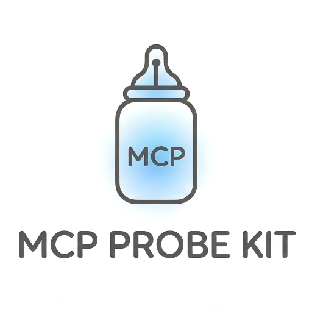

<div align="center">

<h1>知时MCP | mcp-probe-kit</h1>
<p><strong>Connaître le Contexte, Nourrir le Moment.</strong></p>
<p><code>Introspection</code> · <code>Context Hydration</code> · <code>Delegated Orchestration</code></p>
</div>

---

**Talk is cheap, show me the Context.**

> Zhishi MCP est une boîte à outils de sondage au niveau du protocole et d'approvisionnement en contexte conçue pour les geeks. Ce n'est pas seulement une collection de 21 outils, mais un système de perception qui permet à l'IA de vraiment "comprendre" l'intention de votre projet.

**Langues**: [English](../README.md) | [简体中文](README.zh-CN.md) | [日本語](README.ja-JP.md) | [한국어](README.ko-KR.md) | [Español](README.es-ES.md) | **Français** | [Deutsch](README.de-DE.md) | [Português (BR)](README.pt-BR.md)

[](https://www.npmjs.com/package/mcp-probe-kit)
[](https://www.npmjs.com/package/mcp-probe-kit)
[](https://opensource.org/licenses/MIT)
[](https://github.com/mybolide/mcp-probe-kit/stargazers)

> 🚀 Boîte à Outils de Développement Complète Alimentée par l'IA - Couvrant l'Ensemble du Cycle de Vie du Développement

Un puissant serveur MCP (Model Context Protocol) fournissant **21 outils** couvrant le flux de travail complet de l'analyse produit au lancement final (Exigences → Conception → Développement → Qualité → Lancement), tous les outils supportent la **sortie structurée**.

**🎉 Mise à Jour Majeure v3.0**: Nombre d'outils simplifié, focus sur les compétences clés, élimination de la paralysie du choix, permettant à l'IA de faire plus de travail natif

**Supporte Tous les Clients MCP**: Cursor, Claude Desktop, Cline, Continue et plus

**Version du Protocole**: MCP 2025-11-25 · **SDK**: @modelcontextprotocol/sdk 1.25.3

---

## 📚 Documentation Complète

**👉 [https://mcp-probe-kit.bytezonex.com](https://mcp-probe-kit.bytezonex.com/)**

- [Démarrage Rapide](https://mcp-probe-kit.bytezonex.com/pages/getting-started.html) - Configuration en 5 minutes
- [Tous les Outils](https://mcp-probe-kit.bytezonex.com/pages/all-tools.html) - Liste complète de 21 outils
- [Meilleures Pratiques](https://mcp-probe-kit.bytezonex.com/pages/examples.html) - Guide complet du flux de travail de développement
- [Guide de Migration v3.0](https://mcp-probe-kit.bytezonex.com/pages/migration.html) - Mise à niveau de v2.x vers v3.0

---

## ✨ Fonctionnalités Principales

### 📦 21 Outils

- **🔄 Orchestration de Flux de Travail** (6 outils) - Flux de travail de développement complexes en un clic
  - `start_feature`, `start_bugfix`, `start_onboard`, `start_ui`, `start_product`, `start_ralph`
- **🔍 Analyse de Code** (3 outils) - Qualité du code et refactorisation
  - `code_review`, `fix_bug`, `refactor`
- **📝 Outils Git** (2 outils) - Commits Git et rapports de travail
  - `gencommit`, `git_work_report`
- **⚡ Génération de Code** (1 outil) - Génération de tests
  - `gentest`
- **📦 Gestion de Projet** (7 outils) - Initialisation de projet et gestion des exigences
  - `init_project`, `init_project_context`, `add_feature`, `estimate`, `interview`, `ask_user`
- **🎨 Outils UI/UX** (3 outils) - Systèmes de conception et synchronisation de données
  - `ui_design_system`, `ui_search`, `sync_ui_data`

Pour plus de détails sur les fonctionnalités, l'installation et l'utilisation, veuillez consulter la [documentation complète en anglais](../README.md) ou visiter [https://mcp-probe-kit.bytezonex.com](https://mcp-probe-kit.bytezonex.com/).

---

## 🚀 Installation Rapide

### Méthode 1: Utilisation directe avec npx (Recommandé)

**Configuration Cursor / Cline:**
```json
{
  "mcpServers": {
    "mcp-probe-kit": {
      "command": "npx",
      "args": ["mcp-probe-kit@latest"]
    }
  }
}
```

**Configuration Claude Desktop:**
```json
{
  "mcpServers": {
    "mcp-probe-kit": {
      "command": "npx",
      "args": ["-y", "mcp-probe-kit@latest"]
    }
  }
}
```

### Méthode 2: Installation Globale

```bash
npm install -g mcp-probe-kit
```

---

## 💡 Exemples d'Utilisation

```bash
# Développement quotidien
code_review @feature.ts
gentest @feature.ts
gencommit

# Développement de nouvelles fonctionnalités
start_feature user-auth "Fonctionnalité d'authentification utilisateur"

# Correction de bugs
start_bugfix

# Conception de produit
start_product "Plateforme d'éducation en ligne" --product_type=SaaS

# Développement UI
start_ui "Page de connexion" --mode=auto
```

---

## 🤝 Contribution

Les Issues et Pull Requests sont les bienvenues!

---

## 📄 Licence

MIT License

---

## 🔗 Liens

- **Auteur**: [Kyle (小墨)](https://www.bytezonex.com/)
- **GitHub**: [mcp-probe-kit](https://github.com/mybolide/mcp-probe-kit)
- **npm**: [mcp-probe-kit](https://www.npmjs.com/package/mcp-probe-kit)
- **Documentation**: [https://mcp-probe-kit.bytezonex.com](https://mcp-probe-kit.bytezonex.com/)

---

**Made with ❤️ for AI-Powered Development**
